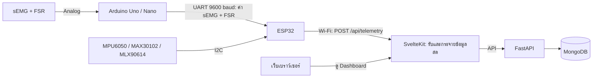

# Cyberpump: Muscle Activity Analyzer

> ระบบสำหรับติดตามการฝึกเวทและวิเคราะห์การทำงานของกล้ามเนื้อแบบเรียลไทม์ โดยเชื่อมข้อมูลจากกล้องและเซนเซอร์เข้ากับเว็บแดชบอร์ด

Cyberpump ช่วยให้ผู้ฝึกเห็นทั้งจำนวนครั้ง คุณภาพของท่า และการตอบสนองของร่างกายระหว่างออกกำลังกาย ข้อมูลจากอุปกรณ์เซนเซอร์จะถูกส่งเข้าระบบเพื่อแสดงผลสด และนำไปสรุปผลเป็นรายเซตและรายเซสชัน

## ฟีเจอร์หลัก

- ติดตามการออกกำลังกายแบบเรียลไทม์ พร้อมจำนวนครั้ง ระยะการเคลื่อนไหว (ROM) ความเร็วการยก และการสูญเสียความเร็ว
- วิเคราะห์จำนวนครั้งที่ทำได้ตามท่าและสัดส่วนความบริสุทธิ์ของท่า พร้อมแสดงคำเตือนระหว่างฝึก
- แสดงข้อมูลจากเซนเซอร์ ได้แก่ sEMG, แรงกำจาก FSR, การเคลื่อนไหวจาก MPU6050, ชีพจรและ SpO₂ จาก MAX30102 และอุณหภูมิผิวจาก MLX90614
- ใช้กล้องและ MediaPipe ตรวจจับการเคลื่อนไหวเพื่อช่วยนับครั้ง พร้อมตัวนับจาก OpenCV สำหรับตรวจสอบการเคลื่อนไหวอีกทาง
- ปรับเทียบค่าเซนเซอร์ บันทึกผลการฝึก และดูสรุปเซตกับเซสชันย้อนหลัง
- ส่งออกข้อมูลการวัดเป็น CSV หรือ JSON ได้

## ส่วนประกอบของระบบ

| ส่วนประกอบ | หน้าที่                                                                                       |
| -------------------- | ---------------------------------------------------------------------------------------------------- |
| `test-sensor/`     | เฟิร์มแวร์ ESP32 และ Arduino สำหรับอ่านเซนเซอร์และส่ง telemetry |

ภาพรวมการไหลของข้อมูล:



Arduino อ่านค่า sEMG และ FSR แล้วส่งให้ ESP32 ผ่าน UART; ESP32 รวมค่ากับข้อมูลจากเซนเซอร์ที่ต่ออยู่กับตัวเอง ก่อนส่ง telemetry ผ่าน Wi-Fi ไปยังเว็บแอป

ดูรายละเอียดการต่อเซนเซอร์และเฟิร์มแวร์ได้ที่ [`test-sensor/README.md`](test-sensor/README.md) และ [ผังขาอุปกรณ์](PINS.md)

## เริ่มรันในเครื่อง

### สิ่งที่ต้องมี

- Docker และ Docker Compose สำหรับ MongoDB
- Python 3.11 ขึ้นไป และ Poetry
- Node.js 20 ขึ้นไป พร้อม npm

### 1. เริ่ม MongoDB

```bash
cd backend
docker compose up -d mongo
```

### 2. ตั้งค่าและเริ่ม Backend

เปิดเทอร์มินัลใหม่:

```bash
cd backend
cp .env.example .env
poetry install
poetry run uvicorn app.main:app --reload --port 9000
```

ไฟล์ตัวอย่างตั้งค่า MongoDB ให้ใช้ `localhost:27017` สำหรับการพัฒนาในเครื่อง หากปรับค่าการเชื่อมต่อหรือ secret ให้แก้ใน `backend/.env`

### 3. ตั้งค่าและเริ่ม Frontend

เปิดอีกเทอร์มินัล:

```bash
cd frontend
cp .env.example .env
npm install
npm run dev
```

เปิดเว็บที่ [http://localhost:5173](http://localhost:5173) โดย Frontend จะเชื่อมกับ Backend ที่ `http://localhost:9000` ตามค่าใน `frontend/.env.example`

Backend สร้างบัญชีทดลองสำหรับพัฒนาไว้ให้ ใช้ `nont@cyberpump.io` และรหัสผ่าน `cyberpump123` เฉพาะในเครื่องพัฒนาเท่านั้น

หากต้องการนำระบบขึ้นเซิร์ฟเวอร์ ดู [คู่มือ Deploy](DEPLOYMENT.md)

## โครงสร้าง Repository

```text
muscle-activity-analyzer/
├── backend/       # FastAPI และการจัดเก็บข้อมูล
├── frontend/      # SvelteKit เว็บแอป
├── test-sensor/   # เฟิร์มแวร์และตัวอย่างทดสอบเซนเซอร์
├── docs/          # เอกสารด้านเซนเซอร์และฮาร์ดแวร์
├── DEPLOYMENT.md  # คู่มือ Deploy และดูแลระบบ
└── PINS.md        # ผังขาอุปกรณ์
```

ทดสอบการตอบสนองของ Backend Health Endpoint:
```bash
curl http://localhost:9000/health
# ผลลัพธ์: {"status":"ok","database":"connected"}
```

เปิดเว็บเบราว์เซอร์เข้าที่: `http://<YOUR_SERVER_PUBLIC_IP>:3000`

---

## 6. การตั้งค่า Nginx Reverse Proxy และ SSL (HTTPS)

สำหรับ Production ควรใช้ Nginx เพื่อรับ Traffic ที่พอร์ต 80/443 และขอใบรับรอง SSL เพื่อความปลอดภัยของข้อมูล

### 6.1 ติดตั้ง Nginx และ Certbot บนเครื่อง Host
```bash
sudo apt install -y nginx certbot python3-certbot-nginx
```

### 6.2 สร้างไฟล์ Nginx Virtual Host
สร้างไฟล์คอนฟิก:
```bash
sudo nano /etc/nginx/sites-available/cyberpump
```

ใส่เนื้อหาดังนี้ (แทนที่ `your-domain.com` ด้วยโดเมนหรือ IP ของคุณ):
```nginx
server {
    listen 80;
    server_name your-domain.com; # หรือใส่ IP Server หากยังไม่มีโดเมน

    # 1. Backend FastAPI endpoints & Swagger Docs
    location ~ ^/(health|docs|openapi.json|v1/|users/) {
        proxy_pass http://127.0.0.1:9000;
        proxy_http_version 1.1;
        proxy_set_header Host $host;
        proxy_set_header X-Real-IP $remote_addr;
        proxy_set_header X-Forwarded-For $proxy_add_x_forwarded_for;
        proxy_set_header X-Forwarded-Proto $scheme;
    }

    # 2. Frontend Web Application & Telemetry Ingest
    location / {
        proxy_pass http://127.0.0.1:3000;
        proxy_http_version 1.1;
        proxy_set_header Upgrade $http_upgrade;
        proxy_set_header Connection 'upgrade';
        proxy_set_header Host $host;
        proxy_cache_bypass $http_upgrade;
        proxy_set_header X-Real-IP $remote_addr;
        proxy_set_header X-Forwarded-For $proxy_add_x_forwarded_for;
        proxy_set_header X-Forwarded-Proto $scheme;
    }
}
```

เปิดใช้งานไซต์และทดสอบ:
```bash
sudo ln -s /etc/nginx/sites-available/cyberpump /etc/nginx/sites-enabled/
sudo nginx -t
sudo systemctl reload nginx
```

### 6.3 ขอใบรับรอง SSL ฟรี (HTTPS) ผ่าน Certbot
*(ต้องมี Domain Name ชี้มาที่ IP Server แล้ว)*
```bash
sudo certbot --nginx -d your-domain.com
```

> [!TIP]
> หากเปิดใช้ HTTPS แล้ว อย่าลืมเข้าไปอัปเดตไฟล์ `.env` ในโปรเจกต์ให้ `ORIGIN=https://your-domain.com` แล้วรัน `docker compose up -d` อีกครั้ง

---

## 7. การตั้งค่าฝั่ง IoT Sensor (ESP32) เข้าสู่ Cloud

เพื่อให้บอร์ด ESP32 สามารถส่งค่า Telemetry (EMG, Force, Heart Rate, IMU) เข้าสู่ระบบบน Cloud ได้:

1. เปิดไฟล์เฟิร์มแวร์ในเครื่องของคุณ: `test-sensor/src/esp32_workout_firmware.cpp`
2. ค้นหาบรรทัดที่ระบุ `serverUrl`:
```cpp
// บรรทัดที่ 163 (หรือค้นหาคำว่า serverUrl)
// เปลี่ยนจาก Local IP เดิม เป็น Cloud IP หรือ Domain ของคุณ
const char* serverUrl = "http://<YOUR_SERVER_PUBLIC_IP>:3000/api/telemetry";

// หรือหากใช้ Nginx / Domain พร้อม HTTPS:
// const char* serverUrl = "https://your-domain.com/api/telemetry";
```
3. ตรวจสอบชื่อ WiFi และ Password ในโค้ด:
```cpp
const char* ssid = "YOUR_WIFI_SSID";
const char* password = "YOUR_WIFI_PASSWORD";
```
4. อัปโหลดเฟิร์มแวร์เข้าบอร์ด ESP32 ผ่าน PlatformIO หรือ Arduino IDE
5. เปิด Serial Monitor เพื่อยืนยันว่า ESP32 เชื่อมต่อ WiFi ได้และส่งแพ็กเก็ตข้อมูลสำเร็จ (`HTTP 200 OK`)

---

## 8. คำสั่ง Maintenance & Operations

### การดู Logs การทำงานแบบ Real-time
```bash
# ดู logs ทุก service พร้อมกัน
docker compose logs -f

# ดูเฉพาะ Backend API
docker compose logs -f backend

# ดูเฉพาะ Frontend
docker compose logs -f frontend

# ดูเฉพาะ MongoDB
docker compose logs -f mongo
```

### การอัปเดตระบบเมื่อมีโค้ดใหม่ (Update & Re-deploy)
เมื่อมีการ push โค้ดใหม่ขึ้น Git repository สามารถดึงและ rebuild ได้ทันที:
```bash
cd ~/muscle-activity-analyzer
git pull origin main
docker compose up -d --build
```
> Docker จะทำการ rebuild เฉพาะ layer ที่มีการเปลี่ยนแปลง ทำให้ใช้เวลาอัปเดตเพียงไม่กี่วินาที

### การสำรองข้อมูล MongoDB (Backup & Restore)
**สำรองข้อมูล (Backup):**
```bash
# สร้างไฟล์ dump สำรองออกมาที่โฟลเดอร์ปัจจุบัน
docker compose exec -T mongo mongodump --db cyberpump --archive > backup_$(date +%Y%m%d_%H%M%S).archive
```

**กู้คืนข้อมูล (Restore):**
```bash
# กู้คืนจากไฟล์ archive
docker compose exec -T mongo mongorestore --archive < backup_filename.archive
```

### การสั่งหยุดและเริ่มระบบ
```bash
# หยุดระบบชั่วคราว
docker compose stop

# เริ่มทำงานใหม่
docker compose start

# ปิดระบบและลบ container (ข้อมูลใน volume ยังคงอยู่ปลอดภัย)
docker compose down
```

---

## 9. การแก้ไขปัญหาที่พบบ่อย (Troubleshooting)

### 1. Cross-site POST form submissions are forbidden (403 ใน SvelteKit)
- **สาเหตุ**: SvelteKit มีระบบป้องกัน CSRF ในตัว หากค่า `ORIGIN` ใน `.env` ไม่ตรงกับ URL ที่เปิดในเบราว์เซอร์
- **วิธีแก้**: แก้ไขค่า `ORIGIN` ใน `.env` ให้ตรงกับ IP หรือ Domain ที่ใช้งานจริง เช่น:
  ```env
  ORIGIN=http://203.0.113.15:3000
  ```
  จากนั้นสั่ง `docker compose up -d`

### 2. Build Frontend ไม่ผ่าน หรือเซิร์ฟเวอร์ค้าง (Out of Memory)
- **สาเหตุ**: การ build SvelteKit และ Vite ใช้ Memory สูง หาก Cloud VM มี RAM เพียง 1GB - 2GB อาจเกิด OOM Kill
- **วิธีแก้**: ตรวจสอบว่าได้เปิดใช้งาน Swap Memory แล้วตาม [ข้อ 4.1](#41-อัปเดตระบบและตั้งค่า-swap-สำหรับเครื่อง-ram-1-2-gb)

### 3. ESP32 ไม่สามารถส่งข้อมูลได้ (Connection Failed / Timeout)
- **วิธีแก้**:
  1. ตรวจสอบว่า Firewall บน Cloud (Security Group) ได้เปิดพอร์ต 3000 หรือ 80 ไว้แล้วหรือไม่
  2. ตรวจสอบว่า WiFi ที่ ESP32 เกาะอยู่สามารถออกอินเทอร์เน็ตได้
  3. ทดสอบยิง HTTP POST จำลองจากเครื่องคอมพิวเตอร์ของคุณ:
     ```bash
     curl -X POST http://<YOUR_SERVER_IP>:3000/api/telemetry \
       -H "Content-Type: application/json" \
       -d '{"device":{"packetCount":1,"rateHz":50},"sensors":{}}'
     ```
     หากได้ `{"success":true,...}` แสดงว่าเซิร์ฟเวอร์ทำงานปกติ ปัญหาอยู่ที่เครือข่ายของ ESP32

### 4. เชื่อมต่อ Backend จาก Frontend ไม่ได้ (Bad Gateway 502)
- **สาเหตุ**: การตั้งค่า `BACKEND_API_URL` ไม่ถูกต้อง
- **วิธีแก้**: เมื่อรันใน Docker Compose ต้องให้ Frontend คุยกับ Backend ผ่านชื่อ container ภายในเครือข่าย Docker:
  ```env
  BACKEND_API_URL=http://backend:9000
  ```
  *(ไม่ต้องใช้ `localhost` หรือ IP ภายนอก เพราะอยู่ภายใน Docker Network เดียวกัน)*

