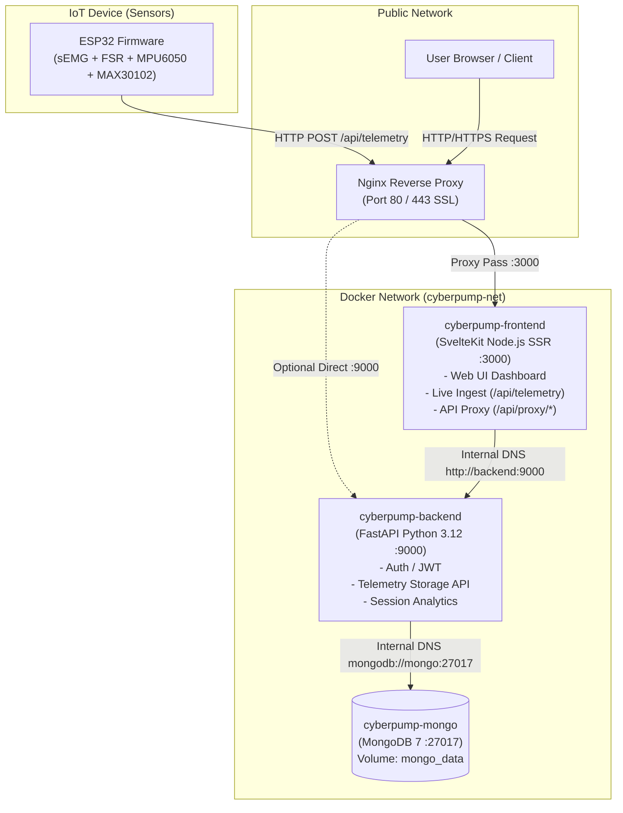

# Cyberpump: Muscle Activity Analyzer 🏋️‍♂️📊
> ระบบตรวจวัดและวิเคราะห์การทำงานของกล้ามเนื้อแบบเรียลไทม์ (Monorepo: Frontend + Backend + IoT Firmware)

เอกสารนี้เป็นคู่มือสำหรับการนำระบบ (Deploy) ขึ้นสู่เซิร์ฟเวอร์ **GCC** (ครอบคลุมทั้ง **GDCC / Government Cloud** ของภาครัฐ/มหาวิทยาลัย และ **Google Cloud Platform / Compute Engine**) โดยใช้ **Docker & Docker Compose**

---

## สารบัญ
1. [ภาพรวมสถาปัตยกรรม (System Architecture)](#1-ภาพรวมสถาปัตยกรรม-system-architecture)
2. [โครงสร้างโปรเจกต์แบบ Monorepo](#2-โครงสร้างโปรเจกต์แบบ-monorepo)
3. [การเตรียม Cloud Server บน GCC](#3-การเตรียม-cloud-server-บน-gcc)
4. [การติดตั้ง Docker บน Ubuntu Server](#4-การติดตั้ง-docker-บน-ubuntu-server)
5. [ขั้นตอนการ Deploy ด้วย Docker Compose](#5-ขั้นตอนการ-deploy-ด้วย-docker-compose)
6. [การตั้งค่า Nginx Reverse Proxy และ SSL (HTTPS)](#6-การตั้งค่า-nginx-reverse-proxy-และ-ssl-https)
7. [การตั้งค่าฝั่ง IoT Sensor (ESP32) เข้าสู่ Cloud](#7-การตั้งค่าฝั่ง-iot-sensor-esp32-เข้าสู่-cloud)
8. [คำสั่ง Maintenance & Operations](#8-คำสั่ง-maintenance--operations)
9. [การแก้ไขปัญหาที่พบบ่อย (Troubleshooting)](#9-การแก้ไขปัญหาที่พบบ่อย-troubleshooting)

---

## 1. ภาพรวมสถาปัตยกรรม (System Architecture)

ระบบประกอบด้วย 3 ส่วนหลักที่เชื่อมต่อกันภายใน Docker Network (`cyberpump-net`):



### การไหลของข้อมูล (Data Flow)
1. **IoT Telemetry**: บอร์ด ESP32 อ่านค่าเซ็นเซอร์ (EMG, FSR, อัตราการเต้นหัวใจ, อุณหภูมิ) แล้วยิง HTTP POST มาที่ `/api/telemetry` บน Frontend
2. **Web Clients**: เบราว์เซอร์เข้าสู่ Web Dashboard ผ่าน Frontend (SvelteKit SSR)
3. **Internal Proxy**: คำขอข้อมูลจากผู้ใช้จะวิ่งผ่าน SvelteKit Proxy ไปยัง FastAPI Backend ภายในเครือข่าย Docker โดยไม่ต้องออกสู่อินเทอร์เน็ตภายนอก
4. **Database**: ข้อมูล Telemetry และบัญชีผู้ใช้ถูกจัดเก็บอย่างปลอดภัยใน MongoDB Volume

---

## 2. โครงสร้างโปรเจกต์แบบ Monorepo

```
muscle-activity-analyzer/
├── docker-compose.yml          # ไฟล์รวม Orchestration ทุก service สำหรับ deploy
├── .env.example                # ตัวอย่าง Environment Variables ของทั้งระบบ
├── backend/                    # FastAPI Backend Service
│   ├── Dockerfile              # Dockerfile ของ Backend (Python 3.12-slim + Poetry)
│   ├── pyproject.toml          # Poetry dependencies
│   ├── app/                    # ซอร์สโค้ด API (Auth, Telemetry, Sessions, DB)
│   └── .env.example
├── frontend/                   # SvelteKit Web Application
│   ├── Dockerfile              # Dockerfile ของ Frontend (Multi-stage Node 22 + pnpm)
│   ├── package.json            # NPM dependencies (Svelte 5, Tailwind v4, adapter-node)
│   ├── src/                    # ซอร์สโค้ด Web UI และ API proxy routes
│   └── .env.example
├── test-sensor/                # เฟิร์มแวร์ Arduino / ESP32 C++ สำหรับเซ็นเซอร์
└── docs/                       # เอกสารการเชื่อมต่อเซ็นเซอร์และฮาร์ดแวร์
```

---

## 3. การเตรียม Cloud Server บน GCC

คำว่า **GCC** โดยทั่วไปในประเทศไทยมักหมายถึง:
1. **GDCC / GCC (Government Data Center and Cloud)**: คลาวด์กลางภาครัฐ (เช่น ระบบคลาวด์ของ ม.สงขลานครินทร์ PSU หรือกระทรวง DE)
2. **Google Cloud Platform (GCP / Compute Engine)**: บริการ Cloud VM ของ Google

ทั้งสองระบบทำงานบน Linux VM เหมือนกัน โดยมีข้อกำหนดในการจัดเตรียมดังนี้:

### 3.1 สเปกเซิร์ฟเวอร์ที่แนะนำ
- **OS**: Ubuntu 22.04 LTS หรือ 24.04 LTS (64-bit)
- **CPU**: 2 vCPU ขึ้นไป
- **RAM**: ขั้นต่ำ 2 GB (หากใช้ 1 GB **ต้อง** ตั้งค่า Swap Memory เพิ่ม)
- **Disk**: 20 GB SSD ขึ้นไป

### 3.2 การตั้งค่า Firewall / Security Group
เปิดพอร์ต (Inbound / Ingress Rules) ดังนี้:

| Port | Protocol | แหล่งที่มา (Source) | วัตถุประสงค์ |
| :--- | :--- | :--- | :--- |
| **22** | TCP | `0.0.0.0/0` (หรือเจาะจง IP) | SSH เข้าจัดการเครื่อง |
| **80** | TCP | `0.0.0.0/0` | HTTP สำหรับ Web และ Let's Encrypt SSL |
| **443** | TCP | `0.0.0.0/0` | HTTPS สำหรับ Web Dashboard ปลอดภัย |
| **3000** | TCP | `0.0.0.0/0` | SvelteKit Frontend (หากไม่ผ่าน Nginx) |
| **9000** | TCP | `0.0.0.0/0` (หรือจำกัดเฉพาะ) | FastAPI Backend API |

> [!WARNING]
> **ห้ามเปิดพอร์ต 27017 (MongoDB) ออกสู่อินเทอร์เน็ตสาธารณะ** โดยใน `docker-compose.yml` ได้ตั้งค่า binding ไว้ที่ `127.0.0.1:27017` เพื่อความปลอดภัยสูงสุด

---

## 4. การติดตั้ง Docker บน Ubuntu Server

SSH เข้าสู่ Cloud Server ของคุณ:
```bash
ssh username@<YOUR_SERVER_IP>
```

### 4.1 อัปเดตระบบและตั้งค่า Swap (สำหรับเครื่อง RAM 1-2 GB)
หากเซิร์ฟเวอร์มี RAM น้อย แนะนำให้สร้าง Swap 2GB เพื่อป้องกันปัญหา Memory เต็ม (Out of Memory - OOM) ระหว่าง Build Container:
```bash
# ตรวจสอบ RAM
free -h

# สร้าง Swap 2GB (หากยังไม่มี)
sudo fallocate -l 2G /swapfile
sudo chmod 600 /swapfile
sudo mkswap /swapfile
sudo swapon /swapfile
echo '/swapfile none swap sw 0 0' | sudo tee -a /etc/fstab
```

### 4.2 ติดตั้ง Docker Engine และ Docker Compose V2
รันคำสั่งด้านล่างเพื่อติดตั้ง Docker เวอร์ชันล่าสุดอย่างเป็นทางการ:
```bash
sudo apt update && sudo apt install -y ca-certificates curl gnupg lsb-release git

# ติดตั้ง GPG key ของ Docker
sudo install -m 0755 -d /etc/apt/keyrings
curl -fsSL https://download.docker.com/linux/ubuntu/gpg | sudo gpg --dearmor -o /etc/apt/keyrings/docker.gpg
sudo chmod a+r /etc/apt/keyrings/docker.gpg

# เพิ่ม Repository
echo \
  "deb [arch=$(dpkg --print-architecture) signed-by=/etc/apt/keyrings/docker.gpg] https://download.docker.com/linux/ubuntu \
  $(lsb_release -cs) stable" | sudo tee /etc/apt/sources.list.d/docker.list > /dev/null

# ติดตั้ง Docker Engine และ Compose Plugin
sudo apt update
sudo apt install -y docker-ce docker-ce-cli containerd.io docker-buildx-plugin docker-compose-plugin

# อนุญาตให้ผู้ใช้ปัจจุบันรัน Docker โดยไม่ต้องใส่ sudo
sudo usermod -aG docker $USER
```

> [!IMPORTANT]
> หลังรันคำสั่ง `usermod` ให้ **Logout แล้ว Login เข้า SSH ใหม่** เพื่อให้สิทธิ์ group docker มีผล:
> ```bash
> exit
> # SSH เข้ามาใหม่อีกครั้ง แล้วทดสอบ:
> docker --version
> docker compose version
> ```

---

## 5. ขั้นตอนการ Deploy ด้วย Docker Compose

### 5.1 โคลนโปรเจกต์ Monorepo
```bash
git clone https://github.com/<your-org>/muscle-activity-analyzer.git
cd muscle-activity-analyzer
```

### 5.2 ตั้งค่า Environment Variables
คัดลอกไฟล์ตัวอย่าง `.env.example` มาเป็น `.env`:
```bash
cp .env.example .env
nano .env
```

ปรับแต่งค่าคอนฟิกสำคัญ:
```env
# ==========================================
# Cyberpump Production Environment
# ==========================================

# 1. ฐานข้อมูล MongoDB (เชื่อมต่อภายใน Docker network)
MONGO_URI=mongodb://mongo:27017/cyberpump

# 2. Secret Key สำหรับ JWT Auth (สุ่มคีย์ปลอดภัยอย่างน้อย 32 ตัวอักษร)
# สร้างได้ด้วยคำสั่ง: openssl rand -hex 32
JWT_SECRET=ใส่_jwt_secret_ที่สุ่มขึ้นมาใหม่_ห้ามใช้ค่าเริ่มต้น

ACCESS_TTL_S=600
REFRESH_TTL_S=604800

# 3. Secret Token สำหรับการส่งข้อมูลจาก SvelteKit -> Backend
TELEMETRY_SERVICE_TOKEN=ใส่_telemetry_token_ที่สุ่มขึ้นมาใหม่
TELEMETRY_RETENTION_DAYS=90

# 4. Frontend Configuration
PUBLIC_APP_TITLE=Cyberpump

# URL ที่ Frontend คุยกับ Backend (ภายใน Docker ใช้ชื่อ service 'backend')
BACKEND_API_URL=http://backend:9000

# ORIGIN ของเว็บสำหรับป้องกัน CSRF (ใส่ IP หรือ Domain ของ Cloud Server)
# ตัวอย่าง: http://203.0.113.10:3000 หรือ https://cyberpump.yourdomain.com
ORIGIN=http://<YOUR_SERVER_PUBLIC_IP>:3000
```

### 5.3 สั่ง Build และ Start Container
รันคำสั่งเดียวที่ root ของโปรเจกต์:
```bash
docker compose up -d --build
```

Docker จะทำการ:
1. ดึง Base image MongoDB 7
2. Build Image ของ FastAPI Backend (`cyberpump-backend`)
3. Build Image ของ SvelteKit Frontend (`cyberpump-frontend`)
4. สร้าง Persistent Volume `cyberpump_mongo_data`
5. เชื่อมต่อทั้ง 3 Service เข้าสู่ `cyberpump_network`

### 5.4 ตรวจสอบสถานะการทำงาน
```bash
# ตรวจสอบสถานะ Container (ต้องขึ้นสถานะ Up ทั้งหมด)
docker compose ps
```

ผลลัพธ์ที่ถูกต้อง:
```text
NAME                 IMAGE                     STATUS         PORTS
cyberpump-mongo      mongo:7                   Up (healthy)   127.0.0.1:27017->27017/tcp
cyberpump-backend    muscle-activity-analyzer-backend    Up             0.0.0.0:9000->9000/tcp
cyberpump-frontend   muscle-activity-analyzer-frontend   Up             0.0.0.0:3000->3000/tcp
```

ทดสอบการตอบสนองของ Backend Health Endpoint:
```bash
curl http://localhost:9000/health
# ผลลัพธ์: {"status":"ok","database":"connected"}
```

เปิดเว็บเบราว์เซอร์เข้าที่: `http://<YOUR_SERVER_PUBLIC_IP>:3000`

---

## 6. การตั้งค่า Nginx Reverse Proxy และ SSL (HTTPS)

สำหรับ Production ควรใช้ Nginx เพื่อรับ Traffic ที่พอร์ต 80/443 และขอใบรับรอง SSL เพื่อความปลอดภัยของข้อมูล

### 6.1 ติดตั้ง Nginx และ Certbot บนเครื่อง Host
```bash
sudo apt install -y nginx certbot python3-certbot-nginx
```

### 6.2 สร้างไฟล์ Nginx Virtual Host
สร้างไฟล์คอนฟิก:
```bash
sudo nano /etc/nginx/sites-available/cyberpump
```

ใส่เนื้อหาดังนี้ (แทนที่ `your-domain.com` ด้วยโดเมนหรือ IP ของคุณ):
```nginx
server {
    listen 80;
    server_name your-domain.com; # หรือใส่ IP Server หากยังไม่มีโดเมน

    # 1. Backend FastAPI endpoints & Swagger Docs
    location ~ ^/(health|docs|openapi.json|v1/|users/) {
        proxy_pass http://127.0.0.1:9000;
        proxy_http_version 1.1;
        proxy_set_header Host $host;
        proxy_set_header X-Real-IP $remote_addr;
        proxy_set_header X-Forwarded-For $proxy_add_x_forwarded_for;
        proxy_set_header X-Forwarded-Proto $scheme;
    }

    # 2. Frontend Web Application & Telemetry Ingest
    location / {
        proxy_pass http://127.0.0.1:3000;
        proxy_http_version 1.1;
        proxy_set_header Upgrade $http_upgrade;
        proxy_set_header Connection 'upgrade';
        proxy_set_header Host $host;
        proxy_cache_bypass $http_upgrade;
        proxy_set_header X-Real-IP $remote_addr;
        proxy_set_header X-Forwarded-For $proxy_add_x_forwarded_for;
        proxy_set_header X-Forwarded-Proto $scheme;
    }
}
```

เปิดใช้งานไซต์และทดสอบ:
```bash
sudo ln -s /etc/nginx/sites-available/cyberpump /etc/nginx/sites-enabled/
sudo nginx -t
sudo systemctl reload nginx
```

### 6.3 ขอใบรับรอง SSL ฟรี (HTTPS) ผ่าน Certbot
*(ต้องมี Domain Name ชี้มาที่ IP Server แล้ว)*
```bash
sudo certbot --nginx -d your-domain.com
```

> [!TIP]
> หากเปิดใช้ HTTPS แล้ว อย่าลืมเข้าไปอัปเดตไฟล์ `.env` ในโปรเจกต์ให้ `ORIGIN=https://your-domain.com` แล้วรัน `docker compose up -d` อีกครั้ง

---

## 7. การตั้งค่าฝั่ง IoT Sensor (ESP32) เข้าสู่ Cloud

เพื่อให้บอร์ด ESP32 สามารถส่งค่า Telemetry (EMG, Force, Heart Rate, IMU) เข้าสู่ระบบบน Cloud ได้:

1. เปิดไฟล์เฟิร์มแวร์ในเครื่องของคุณ: `test-sensor/src/esp32_workout_firmware.cpp`
2. ค้นหาบรรทัดที่ระบุ `serverUrl`:
```cpp
// บรรทัดที่ 163 (หรือค้นหาคำว่า serverUrl)
// เปลี่ยนจาก Local IP เดิม เป็น Cloud IP หรือ Domain ของคุณ
const char* serverUrl = "http://<YOUR_SERVER_PUBLIC_IP>:3000/api/telemetry";

// หรือหากใช้ Nginx / Domain พร้อม HTTPS:
// const char* serverUrl = "https://your-domain.com/api/telemetry";
```
3. ตรวจสอบชื่อ WiFi และ Password ในโค้ด:
```cpp
const char* ssid = "YOUR_WIFI_SSID";
const char* password = "YOUR_WIFI_PASSWORD";
```
4. อัปโหลดเฟิร์มแวร์เข้าบอร์ด ESP32 ผ่าน PlatformIO หรือ Arduino IDE
5. เปิด Serial Monitor เพื่อยืนยันว่า ESP32 เชื่อมต่อ WiFi ได้และส่งแพ็กเก็ตข้อมูลสำเร็จ (`HTTP 200 OK`)

---

## 8. คำสั่ง Maintenance & Operations

### การดู Logs การทำงานแบบ Real-time
```bash
# ดู logs ทุก service พร้อมกัน
docker compose logs -f

# ดูเฉพาะ Backend API
docker compose logs -f backend

# ดูเฉพาะ Frontend
docker compose logs -f frontend

# ดูเฉพาะ MongoDB
docker compose logs -f mongo
```

### การอัปเดตระบบเมื่อมีโค้ดใหม่ (Update & Re-deploy)
เมื่อมีการ push โค้ดใหม่ขึ้น Git repository สามารถดึงและ rebuild ได้ทันที:
```bash
cd ~/muscle-activity-analyzer
git pull origin main
docker compose up -d --build
```
> Docker จะทำการ rebuild เฉพาะ layer ที่มีการเปลี่ยนแปลง ทำให้ใช้เวลาอัปเดตเพียงไม่กี่วินาที

### การสำรองข้อมูล MongoDB (Backup & Restore)
**สำรองข้อมูล (Backup):**
```bash
# สร้างไฟล์ dump สำรองออกมาที่โฟลเดอร์ปัจจุบัน
docker compose exec -T mongo mongodump --db cyberpump --archive > backup_$(date +%Y%m%d_%H%M%S).archive
```

**กู้คืนข้อมูล (Restore):**
```bash
# กู้คืนจากไฟล์ archive
docker compose exec -T mongo mongorestore --archive < backup_filename.archive
```

### การสั่งหยุดและเริ่มระบบ
```bash
# หยุดระบบชั่วคราว
docker compose stop

# เริ่มทำงานใหม่
docker compose start

# ปิดระบบและลบ container (ข้อมูลใน volume ยังคงอยู่ปลอดภัย)
docker compose down
```

---

## 9. การแก้ไขปัญหาที่พบบ่อย (Troubleshooting)

### 1. Cross-site POST form submissions are forbidden (403 ใน SvelteKit)
- **สาเหตุ**: SvelteKit มีระบบป้องกัน CSRF ในตัว หากค่า `ORIGIN` ใน `.env` ไม่ตรงกับ URL ที่เปิดในเบราว์เซอร์
- **วิธีแก้**: แก้ไขค่า `ORIGIN` ใน `.env` ให้ตรงกับ IP หรือ Domain ที่ใช้งานจริง เช่น:
  ```env
  ORIGIN=http://203.0.113.15:3000
  ```
  จากนั้นสั่ง `docker compose up -d`

### 2. Build Frontend ไม่ผ่าน หรือเซิร์ฟเวอร์ค้าง (Out of Memory)
- **สาเหตุ**: การ build SvelteKit และ Vite ใช้ Memory สูง หาก Cloud VM มี RAM เพียง 1GB - 2GB อาจเกิด OOM Kill
- **วิธีแก้**: ตรวจสอบว่าได้เปิดใช้งาน Swap Memory แล้วตาม [ข้อ 4.1](#41-อัปเดตระบบและตั้งค่า-swap-สำหรับเครื่อง-ram-1-2-gb)

### 3. ESP32 ไม่สามารถส่งข้อมูลได้ (Connection Failed / Timeout)
- **วิธีแก้**:
  1. ตรวจสอบว่า Firewall บน Cloud (Security Group) ได้เปิดพอร์ต 3000 หรือ 80 ไว้แล้วหรือไม่
  2. ตรวจสอบว่า WiFi ที่ ESP32 เกาะอยู่สามารถออกอินเทอร์เน็ตได้
  3. ทดสอบยิง HTTP POST จำลองจากเครื่องคอมพิวเตอร์ของคุณ:
     ```bash
     curl -X POST http://<YOUR_SERVER_IP>:3000/api/telemetry \
       -H "Content-Type: application/json" \
       -d '{"device":{"packetCount":1,"rateHz":50},"sensors":{}}'
     ```
     หากได้ `{"success":true,...}` แสดงว่าเซิร์ฟเวอร์ทำงานปกติ ปัญหาอยู่ที่เครือข่ายของ ESP32

### 4. เชื่อมต่อ Backend จาก Frontend ไม่ได้ (Bad Gateway 502)
- **สาเหตุ**: การตั้งค่า `BACKEND_API_URL` ไม่ถูกต้อง
- **วิธีแก้**: เมื่อรันใน Docker Compose ต้องให้ Frontend คุยกับ Backend ผ่านชื่อ container ภายในเครือข่าย Docker:
  ```env
  BACKEND_API_URL=http://backend:9000
  ```
  *(ไม่ต้องใช้ `localhost` หรือ IP ภายนอก เพราะอยู่ภายใน Docker Network เดียวกัน)*

