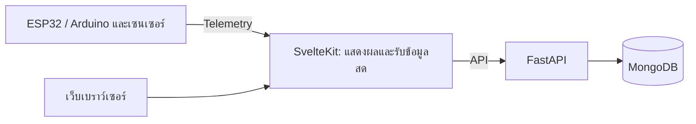

# Cyberpump: Muscle Activity Analyzer

> ระบบสำหรับติดตามการฝึกเวทและวิเคราะห์การทำงานของกล้ามเนื้อแบบเรียลไทม์ โดยเชื่อมข้อมูลจากกล้องและเซนเซอร์เข้ากับเว็บแดชบอร์ด

Cyberpump ช่วยให้ผู้ฝึกเห็นทั้งจำนวนครั้ง คุณภาพของท่า และการตอบสนองของร่างกายระหว่างออกกำลังกาย ข้อมูลจากอุปกรณ์เซนเซอร์จะถูกส่งเข้าระบบเพื่อแสดงผลสด และนำไปสรุปผลเป็นรายเซตและรายเซสชัน

## ฟีเจอร์หลัก

- ติดตามการออกกำลังกายแบบเรียลไทม์ พร้อมจำนวนครั้ง ระยะการเคลื่อนไหว (ROM) ความเร็วการยก และการสูญเสียความเร็ว
- วิเคราะห์จำนวนครั้งที่ทำได้ตามท่าและสัดส่วนความบริสุทธิ์ของท่า พร้อมแสดงคำเตือนระหว่างฝึก
- แสดงข้อมูลจากเซนเซอร์ ได้แก่ sEMG, แรงกำจาก FSR, การเคลื่อนไหวจาก MPU6050, ชีพจรและ SpO₂ จาก MAX30102 และอุณหภูมิผิวจาก MLX90614
- ใช้กล้องและ MediaPipe ตรวจจับการเคลื่อนไหวเพื่อช่วยนับครั้ง พร้อมตัวนับจาก OpenCV สำหรับตรวจสอบการเคลื่อนไหวอีกทาง
- ปรับเทียบค่าเซนเซอร์ บันทึกผลการฝึก และดูสรุปเซตกับเซสชันย้อนหลัง
- ส่งออกข้อมูลการวัดเป็น CSV หรือ JSON ได้

## ส่วนประกอบของระบบ

| ส่วนประกอบ | หน้าที่ |
| --- | --- |
| `frontend/` | เว็บแอป SvelteKit สำหรับแดชบอร์ด การฝึกสด การปรับเทียบ และการดูผลการฝึก |
| `backend/` | FastAPI สำหรับบัญชีผู้ใช้ ข้อมูลเซนเซอร์ การปรับเทียบ และประวัติเซสชัน |
| MongoDB | จัดเก็บผู้ใช้ ข้อมูลการฝึก และข้อมูลที่ระบบต้องเก็บต่อเนื่อง |
| `test-sensor/` | เฟิร์มแวร์ ESP32 และ Arduino สำหรับอ่านเซนเซอร์และส่ง telemetry |

ภาพรวมการไหลของข้อมูล:



ดูรายละเอียดการต่อเซนเซอร์และเฟิร์มแวร์ได้ที่ [`test-sensor/README.md`](test-sensor/README.md) และ [ผังขาอุปกรณ์](PINS.md)

## เริ่มรันในเครื่อง

### สิ่งที่ต้องมี

- Docker และ Docker Compose สำหรับ MongoDB
- Python 3.11 ขึ้นไป และ Poetry
- Node.js 20 ขึ้นไป พร้อม npm

### 1. เริ่ม MongoDB

```bash
cd backend
docker compose up -d mongo
```

### 2. ตั้งค่าและเริ่ม Backend

เปิดเทอร์มินัลใหม่:

```bash
cd backend
cp .env.example .env
poetry install
poetry run uvicorn app.main:app --reload --port 9000
```

ไฟล์ตัวอย่างตั้งค่า MongoDB ให้ใช้ `localhost:27017` สำหรับการพัฒนาในเครื่อง หากปรับค่าการเชื่อมต่อหรือ secret ให้แก้ใน `backend/.env`

### 3. ตั้งค่าและเริ่ม Frontend

เปิดอีกเทอร์มินัล:

```bash
cd frontend
cp .env.example .env
npm install
npm run dev
```

เปิดเว็บที่ <http://localhost:5173> โดย Frontend จะเชื่อมกับ Backend ที่ `http://localhost:9000` ตามค่าใน `frontend/.env.example`

Backend สร้างบัญชีทดลองสำหรับพัฒนาไว้ให้ ใช้ `nont@cyberpump.io` และรหัสผ่าน `cyberpump123` เฉพาะในเครื่องพัฒนาเท่านั้น

หากต้องการนำระบบขึ้นเซิร์ฟเวอร์ ดู [คู่มือ Deploy](DEPLOYMENT.md)

## โครงสร้าง Repository

```text
muscle-activity-analyzer/
├── backend/       # FastAPI และการจัดเก็บข้อมูล
├── frontend/      # SvelteKit เว็บแอป
├── test-sensor/   # เฟิร์มแวร์และตัวอย่างทดสอบเซนเซอร์
├── docs/          # เอกสารด้านเซนเซอร์และฮาร์ดแวร์
├── DEPLOYMENT.md  # คู่มือ Deploy และดูแลระบบ
└── PINS.md        # ผังขาอุปกรณ์
```
