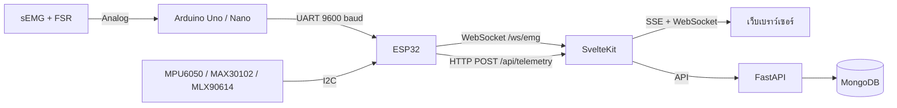

# Cyberpump: Muscle Activity Analyzer

> ระบบสำหรับติดตามการฝึกเวทและวิเคราะห์การทำงานของกล้ามเนื้อแบบเรียลไทม์ โดยเชื่อมข้อมูลจากเซนเซอร์บนร่างกายเข้ากับเว็บแดชบอร์ด

Cyberpump ช่วยให้ผู้ฝึกเห็นทั้งจำนวนครั้ง ระดับการทำงานของกล้ามเนื้อ และการตอบสนองของร่างกายระหว่างออกกำลังกาย ข้อมูลจากอุปกรณ์เซนเซอร์จะถูกส่งเข้าระบบเพื่อแสดงผลสด และนำไปสรุปผลเป็นรายเซตและรายเซสชัน

## ฟีเจอร์หลัก

- นับจำนวนครั้งแบบเรียลไทม์จากสัญญาณ sEMG โดยเทียบกับค่า MVC ที่ปรับเทียบไว้ของผู้ฝึกแต่ละคน และแจ้งเตือนเมื่อกล้ามเนื้อทำงานไม่ถึงเกณฑ์
- แสดงข้อมูลจากเซนเซอร์ ได้แก่ sEMG, แรงกำจาก FSR, การเคลื่อนไหวจาก MPU6050, ชีพจรและ SpO₂ จาก MAX30102 และอุณหภูมิผิวจาก MLX90614
- ตรวจจับการกำหลุดมือจาก FSR พร้อมเตือนด้วยบัซเซอร์บนอุปกรณ์ และแสดงสถานะบนจอ LCD
- เปิดกล้องเว็บแคมเป็นกระจกให้ผู้ฝึกดูท่าของตัวเองระหว่างฝึก (ภาพไม่ถูกบันทึกหรือนำไปประมวลผล)
- ปรับเทียบค่าเซนเซอร์ก่อนฝึก ดูสรุปเซตกับเซสชันย้อนหลัง และเปรียบเทียบผลการฝึก

## โครงสร้างโปรเจกต์

| โฟลเดอร์ | หน้าที่                                                                                                                                         |
| ---------------- | ------------------------------------------------------------------------------------------------------------------------------------------------------ |
| `arduino/`     | เฟิร์มแวร์ Arduino Uno / Nano อ่านค่า sEMG และ FSR ที่ 100 Hz แล้วส่งให้ ESP32 ผ่าน UART                          |
| `esp32/`       | เฟิร์มแวร์ ESP32 (FreeRTOS) อ่านเซนเซอร์ I2C รวมกับค่าจาก Arduino แล้วส่ง telemetry ผ่าน Wi-Fi            |
| `frontend/`    | เว็บแอป SvelteKit รับ telemetry จากอุปกรณ์ กระจายข้อมูลสดให้เบราว์เซอร์ และแสดงแดชบอร์ด |
| `backend/`     | FastAPI สำหรับบัญชีผู้ใช้ การปรับเทียบ และบันทึกผลการฝึกลง MongoDB                                     |

## ภาพรวมการไหลของข้อมูล


```mermaid
flowchart LR
    EMGFSR[sEMG + FSR] -->|Analog| Uno[Arduino Uno / Nano]
    Uno -->|UART 9600 baud| ESP32[ESP32]
    OtherSensors[MPU6050 / MAX30102 / MLX90614] -->|I2C| ESP32
    ESP32 -->|WebSocket /ws/emg| Web[SvelteKit]
    ESP32 -->|HTTP POST /api/telemetry| Web
    Web -->|SSE + WebSocket| Browser[เว็บเบราว์เซอร์]
    Web -->|API| Backend[FastAPI]
    Backend --> Mongo[(MongoDB)]
```

- Arduino อ่านค่า sEMG (A0) และ FSR (A1) แล้วส่งเป็นข้อความ `emg,fsr` ให้ ESP32 ผ่าน UART
- ESP32 ส่งสัญญาณ sEMG แบบต่อเนื่องผ่าน WebSocket `/ws/emg?role=device` ส่วนข้อมูลเซนเซอร์อื่นส่งผ่าน `POST /api/telemetry`
- เซิร์ฟเวอร์ SvelteKit คำนวณสัญญาณ EMG และนับครั้ง แล้วกระจายข้อมูลให้เบราว์เซอร์ผ่าน WebSocket `/ws/emg` และ SSE

## เริ่มรันในเครื่อง

### สิ่งที่ต้องมี

- Docker และ Docker Compose
- Python 3.11 ขึ้นไป และ Poetry
- Node.js 20 ขึ้นไป พร้อม npm

### 1. เริ่ม MongoDB

```bash
cd backend
docker compose up -d mongo
```

### 2. ตั้งค่าและเริ่ม Backend

เปิดเทอร์มินัลใหม่:

```bash
cd backend
cp .env.example .env
poetry install
poetry run uvicorn app.main:app --reload --port 9000
```

ไฟล์ตัวอย่างตั้งค่า MongoDB ให้ใช้ `localhost:27017` สำหรับการพัฒนาในเครื่อง หากปรับค่าการเชื่อมต่อหรือ secret ให้แก้ใน `backend/.env`

### 3. ตั้งค่าและเริ่ม Frontend

เปิดอีกเทอร์มินัล:

```bash
cd frontend
cp .env.example .env
npm install
npm run dev
```

เปิดเว็บที่ [http://localhost:5173](http://localhost:5173) โดย Frontend จะเชื่อมกับ Backend ที่ `http://localhost:9000` ตามค่าใน `frontend/.env.example`

ตั้งค่า `TELEMETRY_SERVICE_TOKEN` ใน `frontend/.env` และ `backend/.env` ให้ตรงกัน เพื่อให้ Frontend ส่งต่อ telemetry ไปยัง Backend ได้

Backend สร้างบัญชีทดลองสำหรับพัฒนาไว้ให้ ใช้ `nont@cyberpump.io` และรหัสผ่าน `cyberpump123` เฉพาะในเครื่องพัฒนาเท่านั้น

### รันทั้งระบบด้วย Docker Compose

จากโฟลเดอร์หลักของโปรเจกต์:

```bash
docker compose up -d --build
```

คำสั่งนี้เริ่ม MongoDB, Backend (พอร์ต 9000) และ Frontend (พอร์ต 3000) หากต้องการเปลี่ยนค่าเริ่มต้น เช่น `JWT_SECRET` หรือ `TELEMETRY_SERVICE_TOKEN` ให้สร้างไฟล์ `.env` ที่โฟลเดอร์หลัก

## อัปโหลดเฟิร์มแวร์

ใช้ Arduino IDE หรือ `arduino-cli`

### Arduino Uno / Nano

อัปโหลด [`arduino/uno_emg_fsr_link.ino`](arduino/uno_emg_fsr_link.ino) ไม่ต้องใช้ไลบรารีเพิ่ม

### ESP32

ต้องใช้ ESP32 Arduino core 3.x และไลบรารีต่อไปนี้:

- Adafruit MLX90614
- SparkFun MAX3010x Pulse and Proximity Sensor
- WebSockets (Markus Sattler)
- LiquidCrystal I2C

ก่อนอัปโหลด [`esp32/esp32.ino`](esp32/esp32.ino) ให้แทนค่าตัวอย่างที่ต้นไฟล์ด้วยเครือข่ายและเซิร์ฟเวอร์ที่ใช้:

```cpp
const char* ssid     = "WIFI_NAME";       // ชื่อ Wi-Fi
const char* password = "WIFI_PASSWORD";   // รหัสผ่าน Wi-Fi

const char* SERVER_HOST = "IP_ADDRESS";   // IP หรือโฮสต์ของเครื่องที่รัน Frontend
const uint16_t SERVER_PORT = 3000;        // พอร์ตของ Frontend (ตัวเลข ไม่ต้องใส่เครื่องหมายคำพูด)
```

ESP32 ส่งข้อมูลไปที่ Frontend ไม่ใช่ Backend ถ้ารัน `npm run dev` ในเครื่องให้ใช้พอร์ต `5173` ถ้ารันด้วย Docker Compose ให้ใช้พอร์ต `3000` และ ESP32 กับเครื่องเซิร์ฟเวอร์ต้องอยู่ในเครือข่ายเดียวกัน

### ผังขาอุปกรณ์ (ESP32)

| อุปกรณ์                         | ขา ESP32                 |
| -------------------------------------- | -------------------------- |
| I2C (MPU6050, MAX30102, MLX90614, LCD) | SDA 21, SCL 22             |
| UART จาก Arduino                    | RX 16, TX 17               |
| ปุ่ม A / ปุ่ม B                | 32 / 33                    |
| บัซเซอร์                       | 25                         |
| จอ LCD 16x2                          | I2C แอดเดรส`0x27` |

ESP32 ทำงานที่ลอจิก 3.3V หากต่อขา TX ของ Arduino (5V) เข้ากับขา RX 16 ควรใช้ตัวแบ่งแรงดันหรือ level shifter
