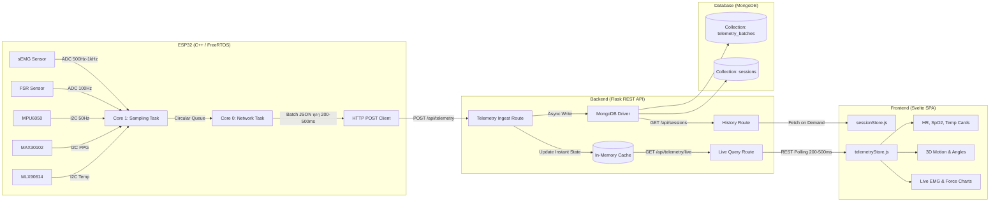

# 📋 ระบบตรวจวัดและวิเคราะห์การทำงานของกล้ามเนื้อ (Muscle Activity Analyzer)
### Technical Specification & Architecture Document

---

## 1. 🎯 ภาพรวมและวัตถุประสงค์ (Overview & Objectives)

**Muscle Activity Analyzer** คือระบบตรวจวัดและวิเคราะห์การทำงานของกล้ามเนื้อและการตอบสนองทางสรีรวิทยาแบบครบวงจร (Multi-modal Physiological & Biomechanical Monitoring System) โดยผสานรวมการวัดสัญญาณไฟฟ้าชีวภาพ แรงกระทำทางกายภาพ การเคลื่อนไหว และสัญญาณชีพเข้าด้วยกัน

### วัตถุประสงค์หลัก
1. **วิเคราะห์การทำงานและความล้าของกล้ามเนื้อ (Muscle Activation & Fatigue Tracking):**
   - วัดสัญญาณไฟฟ้าชีวภาพของกล้ามเนื้อพื้นผิว (**sEMG**)
   - ประมวลผลสัญญาณเบื้องต้นบน Microcontroller: Rectified Signal, Root Mean Square (RMS), และ Mean Absolute Value (MAV)
2. **ประเมินแรงกดและการออกแรงจริง (Force & Physical Interaction):**
   - ตรวจวัดแรงสัมผัส/แรงกดผ่าน **FSR (Force Sensitive Resistor)** เพื่อเทียบเคียงแรงกล้ามเนื้อกับแรงกดที่เกิดขึ้นจริง
3. **ติดตามท่าทางและมุมการเคลื่อนไหว (Kinematics & Posture Analysis):**
   - ตรวจวัดความเร่งและอัตราการหมุน 6 แกน (**MPU-6050**) เพื่อติดตามองศาการเคลื่อนไหว (Pitch, Roll) และเสถียรภาพขณะออกกำลังกายหรือทำกายภาพบำบัด
4. **เฝ้าระวังความปลอดภัยและสัญญาณชีพ (Vital Signs Monitoring):**
   - ตรวจวัดอัตราการเต้นของหัวใจ (Heart Rate) และความอิ่มตัวของออกซิเจนในเลือด (**MAX30102**)
   - วัดอุณหภูมิผิวหนังแบบไร้สัมผัส (**MLX90614**) เพื่อตรวจจับการเปลี่ยนแปลงอุณหภูมิเฉพาะจุดจากการไหลเวียนโลหิตหรือการอักเสบ
5. **จัดเก็บและแสดงผลข้อมูล (Centralized Ingestion & Live Visualization):**
   - ส่งข้อมูลเป็นชุด (Batch) จาก ESP32 เข้าสู่ Python Flask API
   - บันทึกข้อมูลประวัติลง MongoDB แบบ Time-Series Bucketing
   - แสดงผลกราฟสดและสถิติผ่านเว็บแอปพลิเคชัน Svelte ด้วยกลไก Polling (200ms - 500ms)

---

## 2. 🔌 อุปกรณ์ฮาร์ดแวร์และวงจรเชื่อมต่อ (Hardware & Pinout Specification)

### 2.1 รายการอุปกรณ์ (Bill of Materials)

| อุปกรณ์ | หน้าที่หลัก | การเชื่อมต่อกับ ESP32 | ระดับแรงดันไฟเลี้ยง (VCC) | หมายเหตุ |
| :--- | :--- | :--- | :--- | :--- |
| **ESP32 NodeMCU / DevKit** | หน่วยประมวลผลหลัก, รวบรวมข้อมูล, ส่ง HTTP | Microcontroller | 5V / 3.3V | Dual Core 240MHz, Wi-Fi 2.4GHz |
| **sEMG Sensor** (เช่น MyoWare / AD8232) | วัดคลื่นไฟฟ้ากล้ามเนื้อ | **Analog Pin (ADC1)**: `GPIO 34` | 3.3V - 5V | ใช้ ADC1 หลีกเลี่ยง Wi-Fi conflict |
| **FSR Sensor** (Force Sensitive Resistor) | วัดแรงกดสัมผัส | **Analog Pin (ADC1)**: `GPIO 35` | 3.3V | ต่อวงจร Voltage Divider ร่วมกับ R 10kΩ |
| **MPU-6050** | ตรวจจับท่าทาง (Accel + Gyro 6-axis) | **I2C**: SDA (`GPIO 21`), SCL (`GPIO 22`) | 3.3V | I2C Address: `0x68` (AD0=GND) |
| **MAX30102** | ตรวจวัดชีพจร (BPM) และ SpO2 | **I2C**: SDA (`GPIO 21`), SCL (`GPIO 22`) | 3.3V | I2C Address: `0x57` |
| **MLX90614** | วัดอุณหภูมิผิวหนังแบบอินฟราเรด | **I2C**: SDA (`GPIO 21`), SCL (`GPIO 22`) | 3.3V | I2C Address: `0x5A` |

### 2.2 ผังการต่อสายและ I2C Bus Sharing
เซนเซอร์ I2C ทั้ง 3 ตัวใช้งานสายสัญญาณ SDA/SCL ร่วมกันบน Bus เดียวกันได้เนื่องจาก Address ไม่ซ้ำกัน:

```text
               +--------------------------------------+
               |             ESP32 DevKit             |
               +--------------------------------------+
                 |      |       |          |       |
      GPIO 34 <--+      |       |          |       |
      (sEMG ADC)        |       |          |       |
                        |       |          |       |
      GPIO 35 <---------+       |          |       |
      (FSR ADC)                 |          |       |
                                |          |       |
              I2C SDA (GPIO 21) +----------+-------+--------+
                                |          |       |        |
                                |       [MPU6050] [MAX30102] [MLX90614]
                                |        (0x68)    (0x57)     (0x5A)
              I2C SCL (GPIO 22) +----------+-------+--------+
                                |          |       |        |
                                +----------+-------+--------+
                        (Pull-up 4.7kΩ to 3.3V on SDA & SCL)
```

> **ข้อกำหนดสำคัญเรื่อง ADC พิน:**  
> ห้ามใช้พินในกลุ่ม ADC2 (เช่น GPIO 0, 2, 4, 12-15, 25-27) สำหรับเซนเซอร์ Analog เนื่องจากไดรเวอร์ Wi-Fi ของ ESP32 ต้องใช้งาน ADC2 ภายใน การต่อ sEMG และ FSR เข้าพินกลุ่ม ADC1 (`GPIO 32, 33, 34, 35, 36, 39`) เท่านั้นจึงจะทำงานได้อย่างต่อเนื่องและไม่เกิด Error

---

## 3. 🔄 แผนภาพการไหลของข้อมูล (System Architecture Flow)



---

## 4. 📁 โครงสร้างโฟลเดอร์ของโปรเจกต์ (Project Folder Structure)

```text
muscle-activity-analyzer/
├── README.md
├── SYSTEM_SPEC.md                  # เอกสารข้อกำหนดสถาปัตยกรรมฉบับนี้
├── docker-compose.yml              # สำหรับรัน MongoDB + Backend ในตัว
│
├── test-sensor/                    # ชุดทดสอบฮาร์ดแวร์และวินิจฉัยเซนเซอร์ (PlatformIO)
│   ├── platformio.ini              # ตั้งค่า envs แยก flash แต่ละสคริปต์ทดสอบ
│   ├── README.md                   # คู่มือ pinout และวิธีรันการทดสอบ
│   └── src/
│       ├── 01_i2c_scanner.cpp       # สแกนตรวจหา Address (0x68, 0x57, 0x5A)
│       ├── 02_semg_adc_test.cpp     # ทดสอบอ่าน ADC sEMG (GPIO 34)
│       ├── 03_fsr_test.cpp          # ทดสอบอ่าน ADC FSR (GPIO 35)
│       ├── 04_mpu6050_test.cpp      # ทดสอบตรวจจับองศาและการเคลื่อนไหว
│       ├── 05_max30102_test.cpp     # ทดสอบวัดชีพจรและค่า IR LED
│       ├── 06_mlx90614_test.cpp     # ทดสอบวัดอุณหภูมิอินฟราเรด
│       └── 07_all_diagnostics.cpp   # สคริปต์รันเซนเซอร์ 5 ตัวพร้อมกันแบบ Real-time
│
├── iot/                            # ซอร์สโค้ด ESP32 (PlatformIO)
│   ├── platformio.ini              # การตั้งค่าบอร์ด, Libraries และ Build Flags
│   ├── include/
│   │   ├── config.h                # WiFi Credentials, Backend URL, Sampling Intervals
│   │   └── pinout.h                # GPIO Pin Definitions
│   ├── lib/                        # Sensor Driver Modules
│   │   ├── EmgProcessor/           # คำนวณ Raw, Rectification, RMS, MAV
│   │   ├── FsrSensor/              # อ่านค่า ADC และแปลงเป็นแรงกด (N / Raw)
│   │   ├── ImuSensor/              # Driver อ่าน MPU6050 และคำนวณ Pitch/Roll
│   │   ├── OximeterSensor/         # Driver MAX30102 สำหรับ Heart Rate & SpO2
│   │   └── TempSensor/             # Driver MLX90614 อ่านอุณหภูมิ IR
│   └── src/
│       ├── main.cpp                # FreeRTOS Tasks Initialization & Loop
│       ├── network_manager.cpp     # การเชื่อมต่อ Wi-Fi และส่ง HTTP POST Batch
│       └── network_manager.h
│
├── backend/                        # ซอร์สโค้ด Python Flask REST API
│   ├── requirements.txt
│   ├── Dockerfile
│   ├── .env.example
│   ├── run.py                      # จุดเริ่มต้นรันเซิร์ฟเวอร์ Flask
│   └── app/
│       ├── __init__.py             # Application Factory (create_app)
│       ├── config.py               # โหลด Environment Variables
│       ├── extensions.py           # ตัวเชื่อมต่อ PyMongo
│       ├── models/
│       │   ├── telemetry_model.py  # Pydantic Schemas สำหรับตรวจสอบข้อมูลจาก ESP32
│       │   └── session_model.py    # โครงสร้าง Session เอกสาร
│       ├── services/
│       │   ├── telemetry_service.py # บริหาร In-Memory Cache สำหรับ Live Polling & เขียน DB
│       │   └── session_service.py   # บริหารรอบการวัดและคำนวณสถิติภาพรวม
│       └── routes/
│           ├── api_telemetry.py    # POST /api/telemetry, GET /api/telemetry/live
│           ├── api_sessions.py     # POST /start, POST /stop, GET /history
│           └── api_health.py       # Healthcheck endpoint
│
└── frontend/                       # ซอร์สโค้ด Svelte SPA
    ├── package.json
    ├── vite.config.js
    ├── index.html
    └── src/
        ├── app.css                 # สไตล์ชีตหลัก (CSS / Tailwind)
        ├── main.js
        ├── App.svelte              # Root Component
        ├── lib/
        │   ├── api.js              # HTTP Client (fetch wrapper)
        │   └── stores/
        │       ├── telemetryStore.js # Svelte Store พร้อม Polling Engine (200-500ms)
        │       └── sessionStore.js   # สถานะ Active Session
        └── components/
            ├── Navbar.svelte
            ├── SessionControl.svelte # ปุ่มเริ่ม/หยุด และตั้งชื่อ Session
            ├── EmgLiveChart.svelte   # กราฟคลื่นไฟฟ้ากล้ามเนื้อ (Raw + RMS)
            ├── ForceGauge.svelte     # เกจแสดงแรงกด FSR
            ├── MotionCard.svelte     # การ์ดแสดงองศา Pitch/Roll
            ├── VitalsCard.svelte     # การ์ดแสดง Heart Rate, SpO2 และ Skin Temp
            └── SessionSummary.svelte # ตารางสรุปผลและรายงานสถิติ
```

---

## 5. 🗄️ สเปกฐานข้อมูล (MongoDB Schema Spec)

### 5.1 คอลเลกชัน `sessions`
จัดเก็บข้อมูลรอบการวัด การบันทึก หรือการฝึกแต่ละครั้ง

```json
{
  "_id": {"$oid": "6650a1b2c3d4e5f678901234"},
  "session_name": "Biceps Fatigue Test #1",
  "subject_id": "USER_001",
  "target_muscle": "Biceps Brachii",
  "started_at": "2026-09-06T10:30:00.000Z",
  "ended_at": "2026-09-06T10:33:20.000Z",
  "status": "completed",
  "device_id": "ESP32_MUSCLE_01",
  "summary_metrics": {
    "duration_seconds": 200,
    "max_emg_rms": 485.2,
    "avg_emg_rms": 210.4,
    "max_force_newton": 54.0,
    "avg_heart_rate": 115,
    "avg_spo2": 98.2,
    "max_skin_temp_c": 34.5
  },
  "created_at": "2026-09-06T10:30:00.000Z"
}
```

### 5.2 คอลเลกชัน `telemetry_batches` (Time-Series Bucketing)
จัดเก็บข้อมูลดิบและค่าสถิติที่ส่งเข้ามาจาก ESP32 แบบเป็นชุด ช่วยประหยัดเนื้อที่ Index และลด overhead ของ MongoDB

```json
{
  "_id": {"$oid": "6650a200c3d4e5f678901235"},
  "session_id": "6650a1b2c3d4e5f678901234",
  "device_id": "ESP32_MUSCLE_01",
  "batch_timestamp": "2026-09-06T10:30:01.200Z",
  "sample_count": 10,
  "metrics": {
    "emg": {
      "samples": [145, 290, 480, 520, 390, 210, 180, 330, 410, 260],
      "rms": 348.6,
      "mav": 321.5
    },
    "fsr": {
      "raw": 810,
      "force_newton": 15.2
    },
    "motion": {
      "accel_x": 0.08,
      "accel_y": 0.85,
      "accel_z": 0.51,
      "gyro_x": 1.4,
      "gyro_y": -0.8,
      "gyro_z": 0.2,
      "pitch": 42.1,
      "roll": 4.5
    },
    "vitals": {
      "heart_rate": 82,
      "spo2": 98,
      "pulse_valid": true
    },
    "temperature": {
      "skin_temp_c": 33.7,
      "ambient_temp_c": 26.2
    }
  }
}
```

### 5.3 ดัชนีที่แนะนำ (Indexes)
- `db.telemetry_batches.createIndex({ "session_id": 1, "batch_timestamp": 1 })`
- `db.telemetry_batches.createIndex({ "batch_timestamp": -1 })`
- `db.sessions.createIndex({ "status": 1, "started_at": -1 })`

---

## 6. 🌐 ข้อมูลจำเพาะ API (Flask REST API Spec)

### 6.1 `POST /api/telemetry`
- **ผู้เรียก:** ESP32 (ยิงทุกๆ 200ms - 500ms)
- **วัตถุประสงค์:** รับข้อมูล Batch, อัปเดต In-Memory Cache ทันที, และบันทึกลง MongoDB
- **Request Body (JSON):**
```json
{
  "device_id": "ESP32_MUSCLE_01",
  "session_id": "6650a1b2c3d4e5f678901234",
  "timestamp_ms": 1757134201200,
  "emg_samples": [145, 290, 480, 520, 390, 210, 180, 330, 410, 260],
  "emg_rms": 348.6,
  "emg_mav": 321.5,
  "fsr_raw": 810,
  "fsr_force": 15.2,
  "accel": [0.08, 0.85, 0.51],
  "gyro": [1.4, -0.8, 0.2],
  "pitch": 42.1,
  "roll": 4.5,
  "heart_rate": 82,
  "spo2": 98,
  "skin_temp": 33.7,
  "ambient_temp": 26.2
}
```
- **Response `200 OK`:**
```json
{
  "status": "success",
  "recorded": true,
  "server_time": "2026-09-06T10:30:01.215Z"
}
```

---

### 6.2 `GET /api/telemetry/live`
- **ผู้เรียก:** Svelte Frontend (Polling ทุกๆ 200ms - 500ms)
- **วัตถุประสงค์:** ดึงข้อมูล Snapshot ล่าสุดจาก In-Memory Memory Cache โดยไม่ต้องยิง Query เข้า MongoDB ทุกครั้ง
- **Response `200 OK`:**
```json
{
  "device_id": "ESP32_MUSCLE_01",
  "active_session": "6650a1b2c3d4e5f678901234",
  "is_online": true,
  "last_updated": "2026-09-06T10:30:01.215Z",
  "metrics": {
    "emg_rms": 348.6,
    "emg_mav": 321.5,
    "emg_samples": [145, 290, 480, 520, 390, 210, 180, 330, 410, 260],
    "fsr_force": 15.2,
    "pitch": 42.1,
    "roll": 4.5,
    "heart_rate": 82,
    "spo2": 98,
    "skin_temp": 33.7,
    "ambient_temp": 26.2
  }
}
```

---

### 6.3 `POST /api/sessions/start`
- **Request Body:**
```json
{
  "session_name": "Biceps Curl Test",
  "subject_id": "USER_001",
  "target_muscle": "Biceps Brachii"
}
```
- **Response `201 Created`:**
```json
{
  "status": "success",
  "session_id": "6650a1b2c3d4e5f678901234",
  "message": "Session started"
}
```

---

### 6.4 `POST /api/sessions/stop`
- **Request Body:**
```json
{
  "session_id": "6650a1b2c3d4e5f678901234"
}
```
- **Response `200 OK`:** คำนวณค่าเฉลี่ย สรุปผล และเปลี่ยนสถานะเป็น `completed`

---

### 6.5 `GET /api/sessions/<session_id>/history`
- **วัตถุประสงค์:** ดึงข้อมูลย้อนหลังทั้งชุดสำหรับ Session นั้นเพื่อพล็อตกราฟรายงานสถิติ

---

## 7. ⚙️ สเปกด้านสถาปัตยกรรมระดับโมดูล (Component Specs)

### 7.1 IoT Module (ESP32 C++)
1. **FreeRTOS Dual-Task Architecture:**
   - **Task A (Sampling & Feature Extraction - Core 1, Priority 5):**
     - สุ่มอ่าน sEMG ความถี่ 500Hz - 1000Hz ใส่ Ring Buffer
     - คำนวณ Root Mean Square ($RMS = \sqrt{\frac{1}{N}\sum x_i^2}$) และ $MAV = \frac{1}{N}\sum |x_i|$
     - อ่าน I2C Bus (MPU-6050, MAX30102, MLX90614) ทุกๆ 50ms - 100ms
     - บรรจุข้อมูลใส่ Thread-Safe Queue
   - **Task B (Network Ingestion - Core 0, Priority 1):**
     - ตรวจสอบสถานะการเชื่อมต่อ Wi-Fi (มีระบบ Reconnect อัตโนมัติ)
     - นำข้อมูลจาก Queue มารวมเป็น Batch ทุกๆ 200ms - 500ms
     - ใช้ `ArduinoJson` (v7) ทำ Serialization เป็น JSON string
     - ใช้ `HTTPClient` ส่ง `POST /api/telemetry`

### 7.2 Backend Module (Python Flask)
1. **Thread-Safe In-Memory Cache:**
   - ใช้ `dict` พร้อม `threading.Lock()` เก็บสถานะล่าสุดสำหรับรองรับการ Polling ถี่ๆ ของ Svelte โดยไม่ทำให้ MongoDB มีปัญหาภาระการเชื่อมต่อ
2. **MongoDB Ingestion:**
   - เมื่อได้รับข้อมูล ให้เขียนลง Collection `telemetry_batches` ทันที
3. **Session Aggregator:**
   - เมื่อ Session จบลง ให้คำนวณ `max_emg`, `avg_emg`, `fatigue_slope`, `avg_hr` และบันทึกลงในเอกสาร `sessions`

### 7.3 Frontend Module (Svelte)
1. **Telemetry Store Engine (`telemetryStore.js`):**
   - มีฟังก์ชัน `startLivePolling(intervalMs = 300)` และ `stopLivePolling()`
   - บริหาร Buffer อาเรย์ขนาด 50-100 จุด เพื่อส่งต่อไปยัง Component กราฟ
2. **Interactive Visualization:**
   - ใช้ Chart.js / Canvas ในการพล็อตสัญญาณคลื่นไฟฟ้า sEMG และเส้น Envelope RMS
   - เกจวัดแรงสัมผัส FSR (Progress Bar / Circular Gauge)
   - โมเดลแสดงมุม Pitch/Roll ของแขน/ขา
   - แผง Vitals Card แสดงสีเตือนตามเกณฑ์ (เช่น ชีพจรสูงเกิน หรืออุณหภูมิผิดปกติ)

---

## 8. 🧪 ชุดทดสอบฮาร์ดแวร์และการวินิจฉัย (Sensor Testing & Diagnostic Suite)

เพื่อความมั่นใจในความถูกต้องของฮาร์ดแวร์ก่อนเริ่มส่งข้อมูลขึ้นระบบคลาวด์/เซิร์ฟเวอร์ โปรเจกต์ได้จัดเตรียมชุดทดสอบในโฟลเดอร์ `test-sensor/` ที่รองรับทั้ง **ESP32**, **ESP8266**, และ **Arduino Uno (ATmega328P)** โดยมีระบบ Auto-Detection ใน `board_config.h` ปรับพินและระดับแรงดันให้อัตโนมัติ:

### 8.1 ตารางพินเชื่อมต่อเปรียบเทียบตามบอร์ด
| สัญญาณ / เซนเซอร์ | ESP32 DevKit (3.3V) | ESP8266 (3.3V) | Arduino Uno (5.0V) |
| :--- | :--- | :--- | :--- |
| **I2C SDA / SCL** | GPIO 21 / GPIO 22 | GPIO 4 (D2) / GPIO 5 (D1) | A4 / A5 |
| **sEMG (ADC)** | GPIO 34 (ADC1) | A0 (TOUT) | A0 |
| **FSR (ADC)** | GPIO 35 (ADC1) | A0 (สลับสายทดสอบ) | A1 |
| **ADC Resolution** | 12-bit (0-4095) | 10-bit (0-1023) | 10-bit (0-1023) |

> ⚠️ **หมายเหตุ:** สำหรับ Arduino Uno ที่ใช้ Logic 5V หากต่อเซนเซอร์ I2C (MPU6050, MAX30102, MLX90614) แนะนำให้ต่อไฟเลี้ยง 3.3V และตรวจสอบว่าโมดูลมี Logic Level Shifter รองรับสาย 5V หรือใช้โมดูล Level Shifter คั่น

### 8.2 ตัวอย่างคำสั่งรันตามบอร์ดที่ต้องการทดสอบ
```bash
# === ESP32 (บอร์ดหลัก) ===
pio run -d test-sensor -e esp32_i2c_scanner -t upload -t monitor
pio run -d test-sensor -e esp32_all -t upload -t monitor

# === ESP8266 (NodeMCU / D1 Mini) ===
pio run -d test-sensor -e esp8266_i2c_scanner -t upload -t monitor
pio run -d test-sensor -e esp8266_all -t upload -t monitor

# === Arduino Uno / Nano (ATmega328P) ===
pio run -d test-sensor -e uno_i2c_scanner -t upload -t monitor
pio run -d test-sensor -e uno_all -t upload -t monitor
```

---

## 9. 🚀 คำแนะนำในการเริ่มพัฒนา (Implementation Roadmap)

1. **Step 1 - Hardware Verification (`test-sensor/`):**
   - ต่อวงจรบน Breadboard ตามพินที่กำหนด
   - รัน `i2c_scanner` ตรวจสอบ Address ของ MPU-6050, MAX30102, MLX90614
   - รัน `all_diagnostics` เพื่อตรวจสอบการทำงานพร้อมกันของเซนเซอร์ทุกตัว
2. **Step 2 - Backend & Database:**
   - รัน MongoDB ผ่าน `docker-compose up -d`
   - พัฒนา Flask REST API ตามสเปก พร้อมทดสอบ Ingest และ Live Polling Cache
3. **Step 3 - Frontend Dashboard:**
   - พัฒนา Svelte SPA พร้อม Reactive Polling Store เชื่อมกับ Backend
   - แสดงผลกราฟสด sEMG, FSR, IMU และ Vital signs
4. **Step 4 - Full Integration (IoT -> API -> DB -> Frontend):**
   - นำโค้ดเซนเซอร์ไปผสานเข้ากับ FreeRTOS Dual-Task สถาปัตยกรรมหลักใน `iot/`
   - ทดสอบสตรีมข้อมูลครบวงจร

