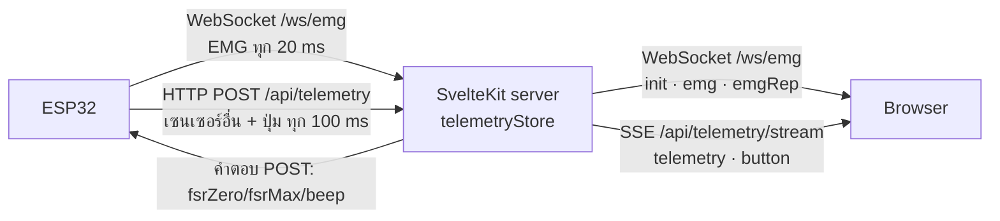

# เปลี่ยนการส่ง EMG เป็น WebSocket

สรุปการเปลี่ยนแปลงที่ย้ายสัญญาณ EMG จาก HTTP POST + SSE ไปใช้ WebSocket ทั้งเส้นทาง
(บอร์ด → เซิร์ฟเวอร์ → เบราว์เซอร์) ส่วนเซนเซอร์อื่นและปุ่มยังใช้ช่องทางเดิม

ภาพรวมทั้งระบบที่อัปเดตแล้วดูที่ [`system_overview.md`](system_overview.md) และเรื่อง task บน ESP32 ดูที่
[`rtos_task_scheduling.md`](rtos_task_scheduling.md)

## ทำไมต้องเปลี่ยน

EMG เป็นสัญญาณที่เปลี่ยนเร็วและต้องเห็นแบบเรียลไทม์ แต่เดิมถูกรวมไปกับ POST ของเซนเซอร์อื่น
ทุกครั้งที่ส่งต้องเปิด HTTP request ใหม่ ต้องมี header ซ้ำ และต้องรอคำตอบก่อนจะส่งรอบถัดไป
WebSocket เปิดการเชื่อมต่อค้างไว้ครั้งเดียวแล้วส่งข้อมูลต่อเนื่องได้ทันที overhead ต่อข้อความต่ำกว่า
และไม่ต้องรอคำตอบ จึงเหมาะกับ EMG ที่ส่งถี่

เซนเซอร์อื่น (FSR, MPU, ชีพจร, อุณหภูมิ) และปุ่ม A/B ยังใช้ POST + SSE ต่อ เพราะเปลี่ยนช้ากว่า
และคำตอบของ POST ใช้ส่งค่า calibrate FSR กับคำสั่งทดสอบ buzzer กลับไปให้บอร์ดอยู่แล้ว

## ก่อน / หลัง

| | ก่อน | หลัง |
|---|---|---|
| EMG จากบอร์ด → เซิร์ฟเวอร์ | อยู่ใน `emg.raw` ของ `POST /api/telemetry` | WebSocket `/ws/emg?role=device` ทุก 20 ms |
| EMG จากเซิร์ฟเวอร์ → เบราว์เซอร์ | SSE event `telemetry` (ส่ง buffer 150 ค่าทุกครั้ง) | WebSocket `/ws/emg` ส่งเฉพาะ sample ใหม่ |
| Event นับ rep (`emgRep`) | SSE | WebSocket |
| FSR / MPU / ชีพจร / อุณหภูมิ / ปุ่ม | POST + SSE | POST + SSE (เหมือนเดิม) |
| รอบ POST ของบอร์ด | 10 ms (commit `9deb4fe`) | 100 ms |
| จำนวน task บน ESP32 | 4 | 5 (เพิ่ม `EmgStreamTask`) |



## รูปแบบข้อมูลบน `/ws/emg`

**บอร์ด → เซิร์ฟเวอร์** (เชื่อมต่อด้วย `?role=device`): text frame เป็นค่า ADC ดิบ 0–4095 คั่นด้วยจุลภาค
ปกติมี 2 ค่าต่อ frame เพราะ sample ทุก 10 ms แต่ส่งทุก 20 ms ต่อด้วย `|` และความเร็วยกสูงสุด (m/s) ในช่วงของ frame นั้น
ความเร็วจึงอยู่บนเส้นเวลาเดียวกับ EMG และตัวนับ rep ใช้หาความเร็วของแต่ละ rep ได้ตรง frame ที่ไม่มีส่วน `|` (firmware เก่า) ยังรับได้

```
2612,2618|0.420
```

**เซิร์ฟเวอร์ → เบราว์เซอร์** (เชื่อมต่อแบบไม่มี `role`): JSON 3 แบบ

| `type` | ส่งเมื่อ | เนื้อหา |
|---|---|---|
| `init` | ตอนเปิดการเชื่อมต่อ | `emg` (รวม `rawBuffer` 150 ค่า), `emgRep`, `lastSeen` |
| `emg` | ทุก frame ที่บอร์ดส่งมา | `samples` (ค่าใหม่ หน่วย µV หลังลบ baseline), `level`, `rms`, `mvcPercent`, `isHighTension`, `highTensionMs` (เวลาใน frame ที่อยู่เหนือเกณฑ์ออกแรงจริง), `emgRep`, `lastSeen` |
| `emgRep` | ตัวตรวจจับนับได้ 1 rep | `count`, `peakPct`, `peakUv`, `durationMs`, `isStrong`, `peakVelocity` (m/s หรือ `null` ถ้าบอร์ดไม่ได้ส่งความเร็ว) |

เบราว์เซอร์ต่อ `samples` เข้า buffer ของตัวเองแล้วตัดให้เหลือ 150 ค่า เซิร์ฟเวอร์จึงไม่ต้องส่ง buffer ทั้งก้อนทุกครั้ง

## ไฟล์ที่เปลี่ยน

### Firmware ESP32 — [`esp32_workout_firmware.ino`](../test-sensor/arduino/esp32_workout_firmware/esp32_workout_firmware.ino)

- เพิ่ม `#include <WebSocketsClient.h>` (library **WebSockets** by Markus Sattler)
- เพิ่ม task `EmgStreamTask` (core 0, priority 3, stack 6144):
  ทุก 20 ms เรียก `emgSocket.loop()` ดึง sample ทั้งหมดจาก `emgQueue` แล้ว `sendTXT()` ถ้าเชื่อมต่ออยู่
  ถ้าหลุดจะต่อใหม่เองทุก 2 วินาที ระหว่างหลุด sample ในคิวถูกทิ้ง ไม่ส่งย้อนหลัง
- `NetworkTask` ไม่ดึง EMG จากคิวแล้ว และเอา `emg` ออกจาก JSON ที่ POST
- `SEND_INTERVAL_MS` เปลี่ยนจาก 10 เป็น 100 ms เพราะ POST เหลือแค่เซนเซอร์ที่เปลี่ยนช้า
- IP/พอร์ตของเซิร์ฟเวอร์รวมไว้ที่ `SERVER_HOST` / `SERVER_PORT` จุดเดียว
  (`serverUrl` ของ POST สร้างจากสองค่านี้)
- Watchdog และ light sleep ลงทะเบียน/ถอด `EmgStreamTask` เหมือน task อื่น
- ใส่ `#include "heartRate.h"` กลับ (ดูหัวข้อ "สิ่งที่ทีมควรรู้")

### เซิร์ฟเวอร์ (SvelteKit)

| ไฟล์ | การเปลี่ยนแปลง |
|---|---|
| [`frontend/emg-ws.js`](../frontend/emg-ws.js) | **ใหม่** WebSocket server ที่ `/ws/emg` ใช้ library `ws` แยกบอร์ดกับเบราว์เซอร์ด้วย `?role=device` มี ping ทุก 15 วินาทีกัน nginx ตัดการเชื่อมต่อ และข้ามเบราว์เซอร์ที่อ่านไม่ทัน (buffer เกิน 1 MB) |
| [`frontend/server.js`](../frontend/server.js) | **ใหม่** entry point ของ production แทน `node build` ใช้ handler ของ SvelteKit ตัวเดิม แล้วต่อ WebSocket ลง http server เดียวกัน |
| [`frontend/vite.config.ts`](../frontend/vite.config.ts) | เพิ่ม plugin `emgWebSocket()` ต่อ WebSocket ตอนรัน `pnpm dev` / `pnpm preview` |
| [`frontend/src/lib/server/telemetryStore.ts`](../frontend/src/lib/server/telemetryStore.ts) | `ingestEmg(raws)` รับ EMG จาก WebSocket แล้วส่ง event `emgStream`; เพิ่ม `emgSnapshot()` และ `sseSnapshot()` (state ที่ไม่มี EMG); เอา `emg` ออกจาก `FullTelemetryPacket`; ลงทะเบียน `globalThis.__cyberpumpEmg` ให้ `emg-ws.js` เรียกใช้ |
| [`frontend/src/routes/api/telemetry/stream/+server.ts`](../frontend/src/routes/api/telemetry/stream/+server.ts) | SSE ส่ง `sseSnapshot()` แทน state ทั้งหมด และเลิกส่ง event `emgRep` |
| [`frontend/src/hooks.server.ts`](../frontend/src/hooks.server.ts) | import `telemetryStore` ตอนเซิร์ฟเวอร์เริ่ม เพื่อให้บอร์ดต่อ WebSocket ได้ทันทีแม้ยังไม่มีใครเปิดหน้าเว็บ |
| `frontend/src/routes/api/emg/+server.ts` | **ลบ** ไม่มีที่ไหนเรียกใช้แล้ว |
| [`frontend/Dockerfile`](../frontend/Dockerfile) | copy `server.js` กับ `emg-ws.js` เข้า image และเปลี่ยน `CMD` เป็น `node server.js` |
| `frontend/package.json` | เพิ่ม `ws` (dependency) และ `@types/ws` (devDependency) |

**ทำไม `emg-ws.js` เป็นไฟล์ JS นอก `src/`:** WebSocket ต้องต่อกับ http server ของ Node โดยตรง
ซึ่งอยู่นอกระบบ module ของ SvelteKit จึง import `telemetryStore.ts` ตรงๆ ไม่ได้
ทั้งสองฝั่งจึงคุยกันผ่าน `globalThis.__cyberpumpEmg` แทน ตัวนับ rep และการแปลงหน่วยใช้โค้ดเดิมทั้งหมด

### เบราว์เซอร์ — [`telemetry.svelte.ts`](../frontend/src/lib/workout/telemetry.svelte.ts)

- เพิ่ม `connectEmgSocket()` เปิด `ws://` หรือ `wss://` ตาม protocol ของหน้าเว็บ ต่อใหม่แบบ backoff 1 → 30 วินาที
- เพิ่ม `onEmgMessage()` จัดการ `init` / `emg` / `emgRep` และสถานะ `emgSocketState`
- เอาการอ่าน `data.emg` / `data.emgRep` และ listener `emgRep` ออกจาก handler ของ SSE
- หน้าจอ กราฟ และหน้า Calibration ไม่ต้องแก้ เพราะยังอ่านค่าจาก `telemetry.emg` / `telemetry.emgRep` เหมือนเดิม

### เอกสาร

- [`system_overview.md`](system_overview.md): แผนภาพ, หัวข้อ 2 (ข้อมูลที่วิ่งระหว่างบอร์ดกับเว็บ), sequence diagram และหัวข้อ RTOS
- [`rtos_task_scheduling.md`](rtos_task_scheduling.md): ตาราง task เป็น 5 task

## สิ่งที่ทีมควรรู้

- **แก้ compile error ใน HEAD:** commit `9deb4fe` ลบ `#include "heartRate.h"` ออกแต่โค้ดยังเรียก `checkForBeat()`
  ทำให้ firmware compile ไม่ผ่าน ใส่กลับให้แล้ว
- **รอบ POST เปลี่ยนจาก 10 ms เป็น 100 ms:** commit เดียวกันตั้งไว้ที่ 10 ms เพื่อให้ EMG เร็วขึ้น
  ตอนนี้ EMG ไม่ได้ไปกับ POST แล้ว การส่งถี่ขนาดนั้นจึงไม่จำเป็นสำหรับเซนเซอร์ที่เหลือ
- **TCP_NODELAY ยังอยู่:** ของเดิมใน `vite.config.ts` และ firmware ไม่ได้แตะ `server.js` และ socket ของ WebSocket ก็เปิด `setNoDelay(true)` ด้วย
- **ไฟล์ PlatformIO ยังไม่ได้แก้:** [`test-sensor/src/esp32_workout_firmware.cpp`](../test-sensor/src/esp32_workout_firmware.cpp)
  ต่างจาก `.ino` มาก่อนหน้านี้แล้ว การเปลี่ยนแปลงนี้ทำเฉพาะ `.ino`
- **Flash ใช้ 89%:** library WebSockets เพิ่มขนาดราว 175 KB เหลือที่ว่างอีกประมาณ 130 KB
- **nginx ไม่ต้องแก้:** `location /` ใน [`DEPLOYMENT.md`](../DEPLOYMENT.md) ส่ง header `Upgrade` / `Connection` ต่ออยู่แล้ว
  และ ping ทุก 15 วินาทีกันไม่ให้โดนตัดที่ 60 วินาที
- **`GET /api/telemetry`** (endpoint ดูสถานะสำหรับ debug) ยังคืน state ทั้งหมดรวม EMG เหมือนเดิม

## วิธีนำไปใช้

1. ติดตั้ง library **WebSockets** (by Markus Sattler) ในเครื่องที่จะ compile firmware
   - Arduino IDE: Library Manager → ค้นหา "WebSockets"
   - หรือ `arduino-cli lib install WebSockets`
2. แก้ `SERVER_HOST` / `SERVER_PORT` ใน `.ino` ให้ตรงกับเครื่องที่รันเว็บ แล้ว upload ขึ้นบอร์ด
3. เปิด Serial Monitor ควรเห็น `[EMG-WS] connected` และ `Telemetry sent -> Code: 200`
4. ฝั่งเว็บ: `pnpm install` แล้วรีสตาร์ท `pnpm dev` หรือ rebuild container ของ frontend
   (`docker compose up -d --build frontend`)

## ผลการทดสอบ

ทดสอบบนเครื่อง dev โดยจำลองบอร์ดด้วยสคริปต์ Node (ยังไม่ได้ทดสอบกับบอร์ดจริง)

| การทดสอบ | ผล |
|---|---|
| จำลองบอร์ดส่ง 150 frame ผ่าน WebSocket (dev server) | เบราว์เซอร์จำลองได้ `init` 1 + `emg` 150 ข้อความ และนับ rep ได้ 1 ครั้งตรงกับสัญญาณที่จำลอง |
| SSE หลังเปลี่ยน | ไม่มี `rawBuffer` / `emgRep` แล้ว มีเฉพาะ FSR, MPU, vitals, device, calibration |
| POST เซนเซอร์อื่น | ตอบ 200 พร้อม `fsrZero` / `fsrMax` / `beep` เหมือนเดิม |
| เบราว์เซอร์จริง (Playwright) หน้า Calibration | เปิด `/ws/emg` และแสดง "สด: 806 µV" ตรงกับค่าที่คำนวณจาก ADC 1000 (1000 / 4095 × 3300) ผ่าน 2 รอบติด |
| Production build + `node server.js` | บอร์ดจำลองต่อได้ทันทีโดยไม่ต้องมีใครเปิดหน้าเว็บก่อน ผลเหมือน dev |
| `svelte-check` | 0 error |
| Compile firmware | ผ่าน |
