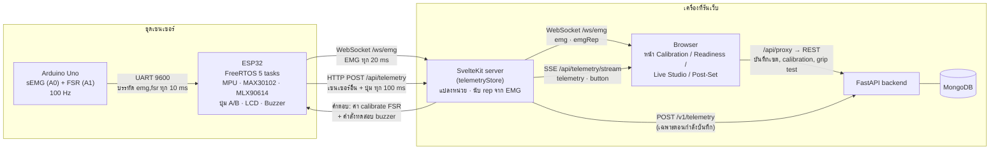
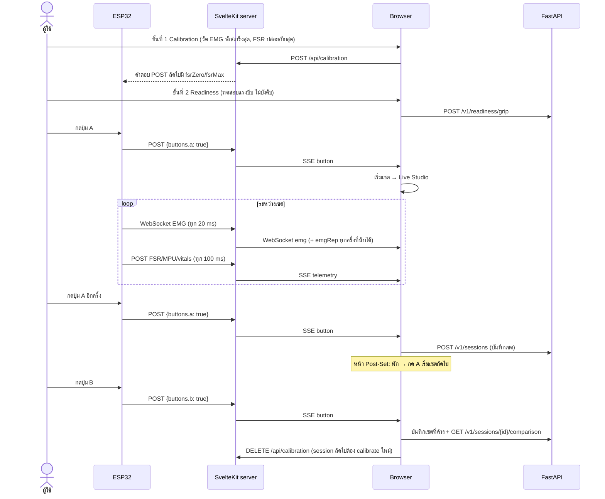
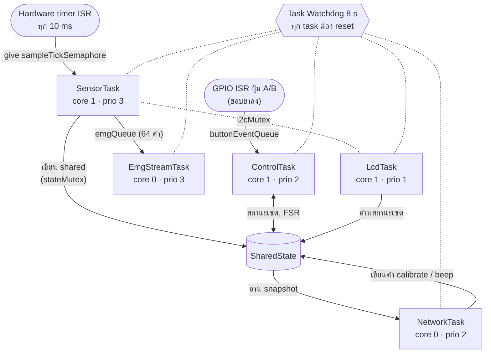
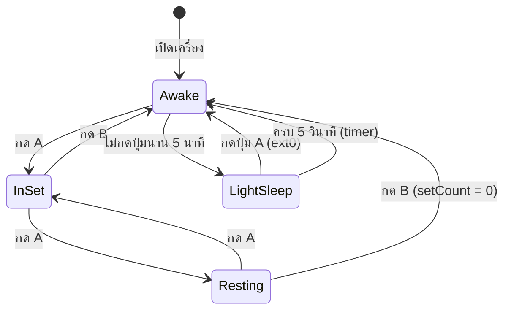

# หลักการทำงานของระบบ: เว็บไซต์ + Embedded

เอกสารนี้อธิบายว่าบอร์ด (Arduino Uno + ESP32) กับเว็บไซต์ (SvelteKit + FastAPI) ส่งข้อมูลหากันอย่างไร
ตั้งแต่กดปุ่มบนบอร์ดจนผลเซตถูกบันทึก และอธิบายการทำงานของ RTOS กับ sleep mode บน ESP32
รายละเอียดเชิงลึกของแต่ละกลไก RTOS ดูได้ที่ [`firmware_rtos_power.md`](firmware_rtos_power.md)
(บางส่วนในไฟล์นั้นเขียนไว้ก่อนการเปลี่ยนแปลงล่าสุด ให้ยึดเอกสารนี้เป็นหลักเมื่อขัดกัน)

ค่าทั้งหมดในเอกสารนี้อ้างอิงจาก
[`esp32_workout_firmware.ino`](../test-sensor/arduino/esp32_workout_firmware/esp32_workout_firmware.ino)
ซึ่งเป็นไฟล์ที่ flash ผ่าน Arduino IDE (สำเนา PlatformIO ที่
[`src/esp32_workout_firmware.cpp`](../test-sensor/src/esp32_workout_firmware.cpp) ต่างกันเล็กน้อย เช่น
watchdog 5 วินาทีแทน 8 วินาที และไม่มี HTTP timeout/backoff)

## 1. ภาพรวม



| ส่วน | หน้าที่หลัก |
|---|---|
| **Arduino Uno** | อ่าน sEMG กับ FSR ด้วย ADC 10-bit ที่ 100 Hz แล้วสเกลเป็น 0–4095 ส่งให้ ESP32 ทาง UART |
| **ESP32** | ส่ง EMG เข้าเว็บทาง WebSocket ทุก 20 ms, อ่านเซนเซอร์ที่เหลือผ่าน I2C แล้วรวมเป็น JSON POST เข้าเว็บทุก 100 ms, รับปุ่ม A/B, แสดง LCD, เตือนด้วย buzzer, เข้า light sleep เมื่อไม่ได้ใช้งาน |
| **SvelteKit server** | รับ telemetry, แปลง ADC เป็นหน่วยที่ใช้ได้ (µV, % แรงบีบ), **นับ rep จาก EMG**, กระจาย EMG ให้ browser ทาง WebSocket และเซนเซอร์อื่นทาง SSE, ส่งค่า calibrate กลับให้บอร์ด |
| **Browser** | แสดงผลสด, คุมลำดับขั้น calibrate → readiness → เซต → สรุป, จับคู่ความเร็วกับแต่ละ rep, บันทึกเซตไป backend |
| **FastAPI + MongoDB** | เก็บผู้ใช้, ผลแต่ละเซต (`session_results`), ค่า calibrate, ผลทดสอบแรงบีบ (`grip_tests`), telemetry ดิบระหว่างบันทึก |

กล้องในหน้า Live Studio เป็นแค่ภาพให้ผู้ใช้ดูฟอร์มตัวเอง ไม่มีการประมวลผลภาพ และไม่ได้ส่งข้อมูลไปไหน

## 2. ข้อมูลที่วิ่งระหว่างบอร์ดกับเว็บ

### 2.1 Uno → ESP32 (UART)

Uno ส่ง 1 บรรทัดทุก 10 ms รูปแบบ `<emg>,<fsr>\n` ค่าเป็น ADC ที่สเกลเป็น 0–4095 แล้ว
(FSR ถูกกลับด้านให้ค่ามาก = บีบแรง) ESP32 อ่านบรรทัดเหล่านี้แบบ non-blocking ใน `SensorTask`
ถ้าไม่มีข้อมูลเกิน 500 ms จะขึ้น `[UART] Uno EMG/FSR link LOST` ใน Serial Monitor

### 2.2 ESP32 → เว็บ: EMG ทาง WebSocket (`/ws/emg?role=device`)

EMG เป็นสัญญาณเดียวที่ไม่ได้ไปกับ POST `EmgStreamTask` ดึง sample ที่ค้างในคิว (100 Hz) ส่งเป็น text frame
ทุก 20 ms รูปแบบ `2612,2618` (ราว 2 ค่าต่อ frame ค่าดิบ ADC 0–4095) ผ่านการเชื่อมต่อ WebSocket ที่เปิดค้างไว้
ถ้าหลุด library จะต่อใหม่เองทุก 2 วินาที ระหว่างหลุด sample ในคิวถูกทิ้ง ไม่ส่งย้อนหลัง

ฝั่งเซิร์ฟเวอร์ WebSocket อยู่ที่ [`emg-ws.js`](../frontend/emg-ws.js) ต่อกับ http server โดยตรง
(dev: plugin ใน `vite.config.ts`, production: [`server.js`](../frontend/server.js)) แล้วส่งค่าเข้า
`telemetryStore.ts` ผ่าน `globalThis.__cyberpumpEmg`

### 2.3 ESP32 → เว็บ: เซนเซอร์อื่นทาง HTTP POST (ทุก 100 ms)

```json
{
  "board": "esp32",
  "fsr": { "force": 2210, "stability": 92.5 },
  "mpu": { "velocity": 0.12, "peakVelocity": 0.48 },
  "vitals": { "hr": 88, "spo2": 97.0, "skinTemp": 33.40, "deltaTemp": 0.20 },
  "buttons": { "a": false, "b": false }
}
```

- `mpu.peakVelocity` คือความเร็วสูงสุดในช่วง 100 ms นั้น เพราะจุดพีคของ rep มักเกิดระหว่างรอบส่ง
- `buttons.a/b` เป็น event ครั้งเดียว: ถ้ากดปุ่ม ค่าจะเป็น `true` ในแพ็กเก็ตถัดไปแพ็กเก็ตเดียว
  (ถ้าส่งไม่สำเร็จ ESP32 จะเก็บไว้ส่งรอบหน้า ปุ่มที่กดจึงไม่หาย)

### 2.4 เว็บ → ESP32 (ในคำตอบของ POST เดียวกัน)

```json
{ "success": true, "fsrZero": 1431, "fsrMax": 4030, "beep": false }
```

เว็บเชื่อมต่อเข้าบอร์ดเองไม่ได้ (บอร์ดอยู่หลัง WiFi และไม่ได้เปิด server) จึงฝากข้อมูลกลับไปในคำตอบของทุก POST:

- `fsrZero` / `fsrMax`: ค่า calibrate FSR ของ session นี้ (ค่าดิบตอนไม่มีแรงกด / บีบสุด) ESP32 ใช้คิด **% แรงกำ**
  เองสำหรับ buzzer ถ้ายังไม่ได้ calibrate ทั้งสองค่าเป็น 0 และ buzzer จะยังไม่เตือน
- `beep`: เป็น `true` ครั้งเดียวหลังผู้ใช้กด "ทดสอบ buzzer" ในหน้า Calibration บอร์ดจะดัง 3 ครั้ง

### 2.5 เว็บ server → browser

EMG ไปทาง **WebSocket `/ws/emg`** ส่วนอื่นไปทาง **SSE `/api/telemetry/stream`**:

| ช่องทาง | ข้อความ | เมื่อไร | ใช้ทำอะไร |
|---|---|---|---|
| WebSocket | `init` | ตอนเปิดการเชื่อมต่อ | buffer EMG ล่าสุด 150 ค่า + ค่า envelope + สถานะตัวนับ rep |
| WebSocket | `emg` | ทุก frame ที่บอร์ดส่งมา (~20 ms) | sample ใหม่ (browser ต่อท้าย buffer เอง), µV, %MVC, สถานะตัวนับ rep |
| WebSocket | `emgRep` | ตัวตรวจจับบน server นับได้ 1 rep | browser บันทึก rep เข้าเซต พร้อมความเร็วสูงสุดของ rep นั้น |
| SSE | `telemetry` | ทุกครั้งที่บอร์ด POST เข้ามา | แรงบีบ %, ความเร็ว, หัวใจ, อุณหภูมิ, สถานะอุปกรณ์, ค่า calibrate (ไม่มี EMG) |
| SSE | `button` | บอร์ดส่ง `buttons.a/b = true` | browser เริ่ม/จบเซต หรือจบการออกกำลังกาย |

## 3. การนับ rep และการแปลงค่า (ทำบน SvelteKit server)

ไฟล์หลัก: [`telemetryStore.ts`](../frontend/src/lib/server/telemetryStore.ts),
[`emgRepDetector.ts`](../frontend/src/lib/server/emgRepDetector.ts)

1. **EMG:** แปลง ADC เป็น µV แล้วลบค่าจุดพัก (baseline) จากการ calibrate → ทำ envelope ด้วยค่าเฉลี่ย 100 ms
   → คิดเป็น % ของแรงสูงสุด (MVC) ที่ calibrate ไว้
2. **นับ rep:** 1 rep = envelope ขึ้นเกิน "เริ่มเกร็ง" (35%) แล้วลงต่ำกว่า "จบ rep" (20%) ภายใน 0.4–4 วินาที
   ถ้าพีคของ rep นั้นไม่ถึง "ออกแรงจริง" (45%) จะนับเป็นท่าโกง (ใช้แรงเหวี่ยง) เกณฑ์ทั้งสามปรับได้ในหน้า Calibration
3. **FSR:** แปลงเป็น % ของแรงบีบสูงสุดที่ calibrate ใน session นั้น (เกิน 100% ได้ถ้าบีบแรงกว่าตอน calibrate)
4. **ความเร็ว (MPU):** browser เอา `peakVelocity` ในช่วงเวลาของแต่ละ rep มาเป็นความเร็วของ rep นั้น
   แล้วเทียบกับ rep แรกของเซตเป็น "ช้าลง %" (velocity loss)

การนับอยู่บน server ไม่ได้อยู่ใน browser เพื่อให้ได้ข้อมูลครบทุก sample ที่ 100 Hz
และไม่ขึ้นกับว่าแท็บ browser ถูกพับหรือเครื่องช้า

## 4. ลำดับการใช้งาน 1 session



- เซตแรกของ session เริ่มได้เฉพาะจากขั้นที่ 2 ด้วยปุ่ม A เท่านั้น ถ้ากดจากหน้าอื่น เว็บจะพาไปขั้นที่ 2 ก่อน
- ปุ่มบนบอร์ดเป็นทางเดียวที่ใช้เริ่ม/จบเซตและจบการออกกำลังกาย หน้าเว็บไม่มีปุ่มเหล่านี้
- ESP32 นับเลขเซตและเวลาบน LCD เองจากการกดปุ่ม เว็บนับ rep และบันทึกผล

## 5. RTOS บน ESP32

ESP32 รัน FreeRTOS อยู่แล้วใต้ Arduino core เฟิร์มแวร์นี้แบ่งงานเป็น 5 task แทน `loop()` เดียว
เพื่อไม่ให้งานช้าอย่าง WiFi POST ไปขวางการอ่านเซนเซอร์ 100 Hz

| Task | Core | Priority | ปลุกด้วย | หน้าที่ |
|---|---|---|---|---|
| `SensorTask` | 1 | 3 (สูงสุด) | semaphore จาก hardware timer ทุก 10 ms | อ่าน UART จาก Uno, MPU (คำนวณความเร็ว), MAX30102, MLX90614 แล้วเขียนค่าล่าสุดลง `shared` และดัน EMG sample เข้าคิว |
| `EmgStreamTask` | 0 | 3 | `vTaskDelayUntil` ทุก 20 ms | ดึง EMG ทั้งคิว → ส่งเป็น WebSocket frame, เรียก `loop()` ของ WebSocket client (ต่อใหม่เองถ้าหลุด) |
| `NetworkTask` | 0 | 2 | `vTaskDelayUntil` ทุก 100 ms | snapshot จาก `shared` (ไม่มี EMG) → POST เข้าเว็บ → อ่านคำตอบ (ค่า calibrate / คำสั่ง beep) |
| `ControlTask` | 1 | 2 | คิวปุ่มจาก ISR (รอสูงสุด 100 ms) | จัดการสถานะเซตตามปุ่ม, คุม buzzer, ตรวจว่าควรเข้า sleep หรือยัง |
| `LcdTask` | 1 | 1 (ต่ำสุด) | `vTaskDelayUntil` ทุก 200 ms | วาดจอ LCD (เลขเซต, RUNNING/RESTING, เวลา) |



**กลไกที่ใช้**

- **Hardware timer + ISR:** timer ยิงทุก 10 ms แล้ว ISR แค่ "ให้" semaphore `SensorTask` ที่รออยู่จึงตื่นมาอ่านตรงจังหวะ
  ไม่ต้องวนเช็ก `millis()`
- **GPIO interrupt (ปุ่ม):** ISR ส่งรหัสปุ่มเข้าคิวแล้วจบ งานจริง (เช็กว่ากดจริงไหม, เปลี่ยนสถานะเซต) ทำใน `ControlTask`
  ซึ่งรอ 30 ms ให้หน้าสัมผัสนิ่ง อ่านขาซ้ำ และรับการกดเพียงครั้งเดียวต่อการกดหนึ่งรอบ
- **Queue:** `emgQueue` ส่ง EMG จาก task 100 Hz ไป `EmgStreamTask` (50 Hz) โดยไม่ต้องล็อก ถ้าคิวเต็มจะทิ้งค่าที่เก่าที่สุด
  `SensorTask` จึงไม่ถูกบล็อก
- **Mutex:** `stateMutex` ป้องกัน `SharedState` ที่หลาย task อ่าน/เขียน `i2cMutex` กันไม่ให้ `SensorTask`
  กับ `LcdTask` ใช้บัส I2C พร้อมกัน (LCD กับเซนเซอร์อยู่บัสเดียวกัน)
- **แยก core:** งานเครือข่ายทั้งสอง (`EmgStreamTask`, `NetworkTask`) อยู่ core 0 POST ที่ใช้เวลา 80–110 ms
  (หรือนานกว่าตอน WiFi แย่) จึงไม่ทำให้การอ่านเซนเซอร์บน core 1 ช้าลง และ `EmgStreamTask` มี priority สูงกว่า
  `NetworkTask` การรอ POST จึงไม่ทำให้ EMG ส่งช้า
- **Task watchdog (8 วินาที):** ทุก task ต้องเรียก `esp_task_wdt_reset()` ในแต่ละรอบ ถ้า task ไหนค้างเกิน 8 วินาที
  ชิปจะ reboot เอง HTTP timeout ถูกตั้งไว้สั้นกว่านี้ (connect 1.5 s, read 3 s) เพื่อไม่ให้ POST ที่ค้างทำให้บอร์ดรีสตาร์ท

## 6. Sleep mode

### 6.1 ESP32: light sleep เมื่อไม่ได้ใช้งาน

ESP32 จะเข้า **light sleep** เมื่อ **ไม่ได้อยู่ในเซต, ยังไม่ได้เริ่มเซตไหนเลยตั้งแต่เปิดเครื่องหรือกด B, และไม่มีการกดปุ่มนาน 5 นาที**
(เปิด/ปิดได้ที่ `ENABLE_LIGHT_SLEEP`)
ระหว่างพักระหว่างเซตจะไม่ sleep เพราะต้องอ่านชีพจรและ EMG ต่อเนื่อง



**ขั้นตอนตอนเข้า sleep** (`enterLightSleepUntilWake()` เรียกจาก `ControlTask`)

1. LCD ขึ้น `SLEEPING... / PRESS ANY BUTTON`
2. ปิด WiFi
3. ถอดทุก task ออกจาก watchdog แล้วปิด watchdog เพราะ timer ของ watchdog นับต่อระหว่าง sleep
   ถ้าไม่ปิด ตื่นมาจะถูกมองว่าค้างแล้ว reboot
4. ตั้งแหล่งปลุก 2 แบบ:
   - **ปุ่ม A (GPIO32) เป็น LOW** ผ่าน `ext0` ใช้ได้เฉพาะปุ่ม A เพราะ ext0 รับขาเดียว และ ext1 ของ ESP32 รุ่นนี้รองรับแค่
     "ทุกขาเป็น LOW" หรือ "ขาใดขาหนึ่งเป็น HIGH" ซึ่งใช้กับปุ่ม active-low สองปุ่มไม่ได้
   - **timer 5 วินาที** กันไม่ให้หลับค้างตลอดไป
5. `esp_light_sleep_start()`: CPU หยุด, task ทั้งหมดหยุดอยู่กับที่ (RAM ยังอยู่ครบ) จนกว่าจะมีแหล่งปลุก

**ตอนตื่น:** เปิด watchdog ใหม่และใส่ task กลับ, ต่อ WiFi ใหม่, รีเซ็ตนาฬิกา idle แล้ว task ทำงานต่อจากจุดเดิม
ต่างจาก deep sleep ตรงที่ light sleep ไม่ reboot ข้อมูลใน RAM และสถานะเซตไม่หาย

> ⚠️ **ข้อจำกัดที่ควรรู้:** ตื่นจาก timer 5 วินาทีก็นับเป็นการตื่นเหมือนกดปุ่ม บอร์ดจะรีเซ็ตนาฬิกา idle
> แล้วตื่นอยู่อีก 5 นาทีก่อนหลับรอบใหม่ ผลคือหลับประมาณ 5 วินาทีต่อทุก 5 นาที ประหยัดไฟได้น้อยมาก
> ถ้าต้องการให้ประหยัดจริง ควรให้ตื่นจาก timer แล้วหลับต่อทันที โดยรีเซ็ต idle เฉพาะตอนตื่นจากปุ่ม
> (`esp_sleep_get_wakeup_cause() == ESP_SLEEP_WAKEUP_EXT0`) และไม่ต่อ WiFi ใหม่ถ้าจะหลับต่อ
>
> อีกข้อ: หลังตื่น `connectWiFi()` รอเชื่อมต่อได้นานสุด 20 วินาที (40 × 500 ms) อยู่ใน `ControlTask`
> ซึ่งถูกใส่กลับเข้า watchdog แล้ว ถ้า WiFi ต่อไม่ได้ภายใน 8 วินาที watchdog จะ reboot บอร์ด

### 6.2 Arduino Uno: หลับระหว่าง sample

Uno ไม่ได้ใช้ RTOS (RAM 2 KB ไม่พอ) แต่ใช้กลไกของชิป AVR โดยตรง:

- **Timer1 (CTC mode)** ยิง interrupt ทุก 10 ms (100 Hz)
- **ADC interrupt:** เริ่มแปลง EMG แล้วต่อ FSR อัตโนมัติ ไม่ต้องรอแบบ busy-wait
- **`SLEEP_MODE_IDLE`:** CPU หลับระหว่างรอ timer และรอ ADC แปลงเสร็จ ประหยัดไฟ และค่า ADC นิ่งขึ้นเพราะวงจรดิจิทัลเงียบ
  (ใช้โหมด idle เพราะโหมดที่ลึกกว่านี้จะปิด Timer1 กับ ADC ที่ต้องใช้)
- **Watchdog 2 วินาที:** ถ้ารอบการอ่านไม่เสร็จใน 2 วินาที ชิปจะ reset เอง

## 7. Buzzer (ความปลอดภัยเรื่องแรงกำ)

`ControlTask` คุม buzzer ทุก ~100 ms โดยใช้ **% แรงกำ** ที่ ESP32 คิดเองจากค่า calibrate ที่เว็บส่งกลับมา:

- ระหว่างเซต ถ้าเคยกำเกิน 20% แล้ว**แรงกำตกลงต่ำกว่า 60% ของระดับที่ถืออยู่** หรือต่ำกว่า 10% นาน 0.2 วินาที → ดังทันที
  และหยุดเองเมื่อกลับมากำถึง 75% ของระดับเดิม
- ถ้ามือจับไม่นิ่ง (ความนิ่ง < 70%) ติดต่อกัน 3 วินาที → ดัง
- เป็น active buzzer (ดังเองเมื่อได้ไฟ DC) จึงขับด้วย `digitalWrite` HIGH/LOW
- ตอนบูตจะดัง 2 ครั้งเป็นการทดสอบตัวเอง และทดสอบจากเว็บได้ด้วยปุ่ม "ทดสอบ buzzer" ในหน้า Calibration

การตัดสินใจอยู่บนบอร์ด ไม่ต้องรอเว็บ จึงเตือนได้ทันทีแม้ WiFi ช้าหรือหลุด (ใช้ค่า calibrate ล่าสุดที่ได้รับไว้)

## 8. การตั้งค่าที่ต้องแก้เมื่อย้ายเครื่อง / เครือข่าย

| ค่า | อยู่ที่ | หมายเหตุ |
|---|---|---|
| `ssid`, `password` | firmware ESP32 | WiFi ที่บอร์ดใช้ ต้องเป็นวงเดียวกับเครื่องที่รันเว็บ |
| `serverUrl` | firmware ESP32 | `http://<IP เครื่องที่รันเว็บ>:5173/api/telemetry` (พอร์ต 3000 ถ้ารันผ่าน Docker) |
| `BACKEND_API_URL` | `frontend/.env` | ที่อยู่ FastAPI ที่ SvelteKit server เรียก |
| `TELEMETRY_SERVICE_TOKEN` | `frontend/.env` + `backend/.env` | ต้องตรงกัน ใช้ตอน SvelteKit ส่ง telemetry ดิบเข้า backend ระหว่างบันทึก |

กล้องในเบราว์เซอร์เปิดได้เฉพาะเว็บที่เข้าผ่าน `https` หรือ `localhost` ถ้าเปิดด้วย IP แบบ `http` กล้องจะใช้ไม่ได้
(ส่วนอื่นใช้ได้ปกติ)
