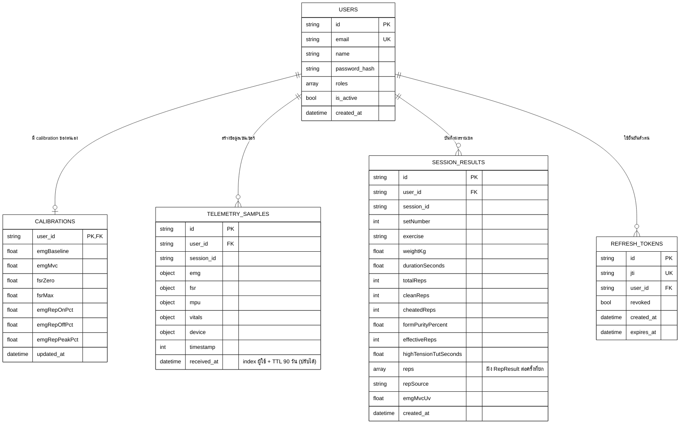

# แผนภาพฐานข้อมูล (ER Diagram)

ไฟล์นี้อธิบายโครงสร้าง MongoDB จาก `backend/app/db.py` และ `backend/app/models/` เท่านั้น ใช้ประกอบหัวข้อ 5.2 เป็นหลัก

Mermaid ตั้งใจออกแบบให้ใช้พื้นหลังสีขาว เส้นสีดำ และรูปแบบเรียบง่าย เพื่อให้แคปภาพไปใส่ในรายงานได้ง่าย โดยไม่ฝังรูปภาพลงในเอกสาร Word

## ER Diagram: Collections และความสัมพันธ์

ตำแหน่งแนะนำในรายงาน: ข้อ 5.1 และ 5.2



## DBML สำหรับ dbdiagram.io

โครงสร้างเดียวกันในรูปแบบ DBML — คัดลอกไปวางที่ [dbdiagram.io](https://dbdiagram.io) ได้โดยตรง

```dbml
Table users {
  id string [pk]
  email string [unique]
  name string
  password_hash string
  roles string [note: 'array']
  is_active bool
  created_at datetime
}

Table refresh_tokens {
  id string [pk]
  jti string [unique]
  user_id string
  revoked bool
  created_at datetime
  expires_at datetime
}

Table telemetry_samples {
  id string [pk]
  user_id string
  session_id string
  emg object
  fsr object
  mpu object
  vitals object
  device object
  timestamp int
  received_at datetime [note: 'index ผู้ใช้ + TTL 90 วัน (ปรับได้)']
}

Table session_results {
  id string [pk]
  user_id string
  session_id string
  setNumber int
  exercise string
  weightKg float
  durationSeconds float
  totalReps int
  cleanReps int
  cheatedReps int
  formPurityPercent float
  effectiveReps int
  highTensionTutSeconds float
  reps string [note: 'array ฝัง RepResult ต่อครั้งที่ยก']
  repSource string
  emgMvcUv float
  created_at datetime
}

Table calibrations {
  user_id string [pk]
  emgBaseline float
  emgMvc float
  fsrZero float
  fsrMax float
  emgRepOnPct float
  emgRepOffPct float
  emgRepPeakPct float
  updated_at datetime
}

Ref: refresh_tokens.user_id > users.id
Ref: telemetry_samples.user_id > users.id
Ref: session_results.user_id > users.id
Ref: calibrations.user_id - users.id
```

## หมายเหตุสำหรับการแคปภาพ

1. เปิดไฟล์นี้ใน editor ที่รองรับ Mermaid หรือ Mermaid Live Editor
2. ตรวจให้พื้นหลังเป็นสีขาวและอ่านข้อความได้ครบก่อน export
3. Export เป็น PNG หรือ SVG แล้วนำไปวางในหัวข้อ 5.1/5.2 ของรายงาน

## ขอบเขตที่ไม่ได้รวมในแผนภาพนี้

`backend/app/db.py` ยังสร้าง index ให้ collection `grip_tests` (ผลการทดสอบแรงกำก่อนเริ่มฝึก) และ `subscriptions` (แพ็กเกจสมาชิก/การชำระเงินผ่าน Omise) ซึ่งเป็นฟีเจอร์ที่ไม่ได้อยู่ในหัวข้อ 5.2 ของรายงานฉบับนี้ หากต้องการให้ครอบคลุมทั้งระบบ ควรเพิ่มทั้งสอง collection นี้ในตารางและแผนภาพด้วย
