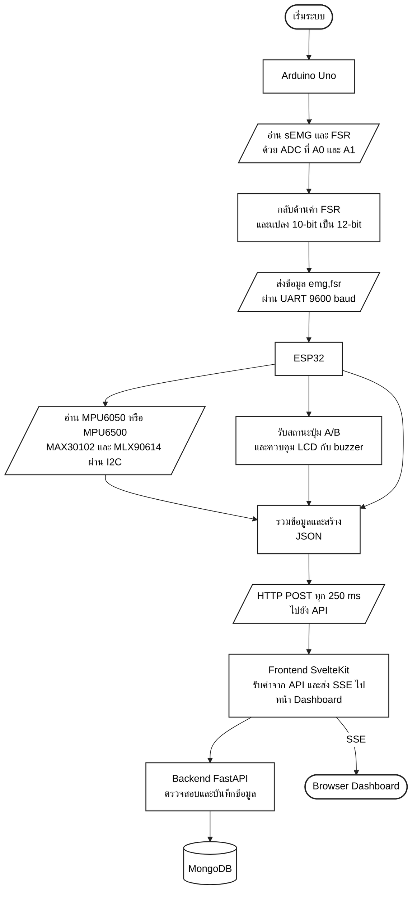
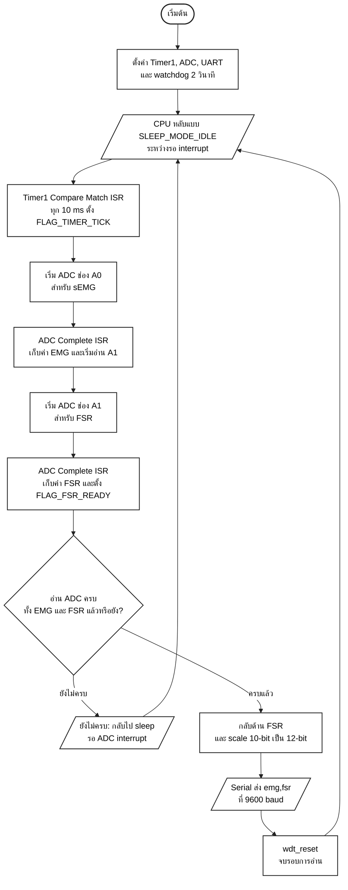
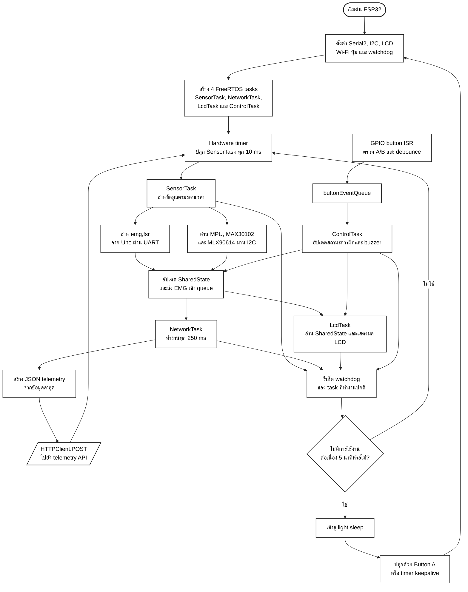

# Flowchart สำหรับรายงาน

ไฟล์นี้อธิบายการทำงานจาก source code ในสองโฟลเดอร์ต่อไปนี้:

- `test-sensor/arduino/uno_emg_fsr_link/`
- `test-sensor/arduino/esp32_workout_firmware/`

Mermaid ทุกชุดตั้งใจออกแบบเป็นแนวตั้ง อ่านจากบนลงล่าง ใช้พื้นหลังสีขาว เส้นสีดำ และรูปแบบ node เรียบง่าย เพื่อให้แคปภาพไปใส่ในรายงานได้ง่าย โดยไม่ฝังรูปภาพลงในเอกสาร Word

## Flowchart 1: ภาพรวมการส่งข้อมูลจาก Uno ไป Backend

ตำแหน่งแนะนำในรายงาน: ข้อ 3.2 และ 7.5

## Flowchart 2: Uno Timer, Interrupt, ADC และ UART

ตำแหน่งแนะนำในรายงาน: ข้อ 7.2

## Flowchart 3: ESP32 Task, I2C, UART, Interrupt และ API

ตำแหน่งแนะนำในรายงาน: ข้อ 7.3

## หมายเหตุสำหรับการแคปภาพ

1. เปิดไฟล์นี้ใน editor ที่รองรับ Mermaid หรือ Mermaid Live Editor
2. Render Flowchart 1, 2 และ 3 แยกกัน
3. ตรวจให้พื้นหลังเป็นสีขาวและอ่านข้อความได้ครบก่อน export
4. Export เป็น PNG หรือ SVG
5. นำภาพไปวางตามตำแหน่งที่ระบุในรายงาน
