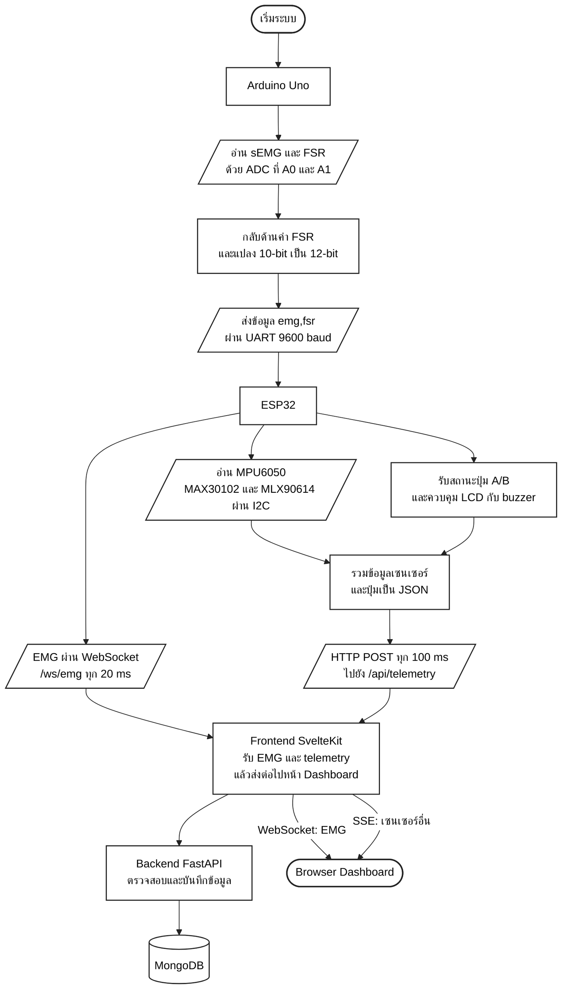
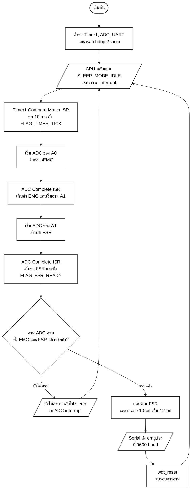
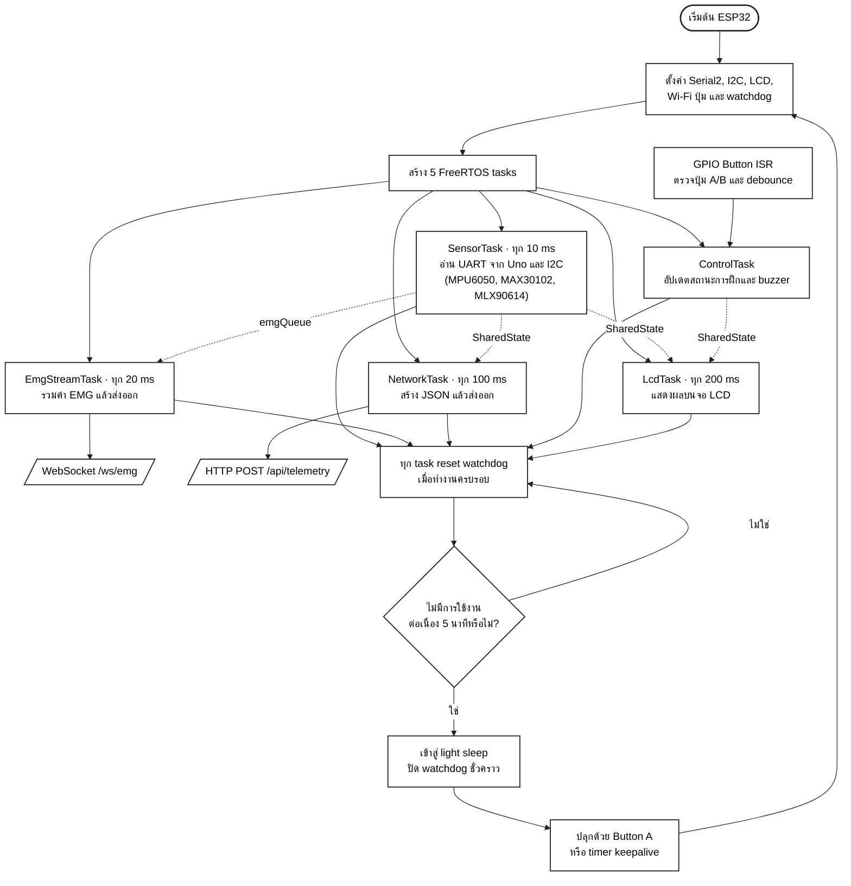

# Flowchart สำหรับรายงาน

ไฟล์นี้อธิบายการทำงานจาก source code ในสองโฟลเดอร์ต่อไปนี้:

- `test-sensor/arduino/uno_emg_fsr_link/`
- `test-sensor/arduino/esp32_workout_firmware/`

Mermaid ทุกชุดตั้งใจออกแบบเป็นแนวตั้ง อ่านจากบนลงล่าง ใช้พื้นหลังสีขาว เส้นสีดำ และรูปแบบ node เรียบง่าย เพื่อให้แคปภาพไปใส่ในรายงานได้ง่าย โดยไม่ฝังรูปภาพลงในเอกสาร Word

## Flowchart 1: ภาพรวมการส่งข้อมูลจาก Uno ไป Backend

ตำแหน่งแนะนำในรายงาน: ข้อ 2.2 และ 6.5

```mermaid
%%{init: {"theme":"base", "themeVariables": {"background":"#ffffff", "primaryColor":"#ffffff", "primaryTextColor":"#000000", "primaryBorderColor":"#222222", "lineColor":"#222222", "secondaryColor":"#ffffff", "tertiaryColor":"#ffffff", "fontFamily":"Arial"}}}%%
flowchart TD
    Start([เริ่มระบบ])
    Uno[Arduino Uno]
    ReadAnalog[/อ่าน sEMG และ FSR<br/>ด้วย ADC ที่ A0 และ A1/]
    Scale[กลับด้านค่า FSR<br/>และแปลง 10-bit เป็น 12-bit]
    UART[/ส่งข้อมูล emg,fsr<br/>ผ่าน UART 9600 baud/]
    ESP[ESP32]
    ReadI2C[/อ่าน MPU6050<br/>MAX30102 และ MLX90614 ผ่าน I2C/]
    Inputs[รับสถานะปุ่ม A/B<br/>และควบคุม LCD กับ buzzer]
    EmgWS[/"EMG ผ่าน WebSocket<br/>/ws/emg ทุก 20 ms"/]
    Telemetry[รวมข้อมูลเซนเซอร์<br/>และปุ่มเป็น JSON]
    HTTP[/"HTTP POST ทุก 100 ms<br/>ไปยัง /api/telemetry"/]
    Web[Frontend SvelteKit<br/>รับ EMG และ telemetry<br/>แล้วส่งต่อไปหน้า Dashboard]
    Backend[Backend FastAPI<br/>ตรวจสอบและบันทึกข้อมูล]
    Mongo[(MongoDB)]
    Browser([Browser Dashboard])

    Start --> Uno
    Uno --> ReadAnalog
    ReadAnalog --> Scale
    Scale --> UART
    UART --> ESP
    ESP --> ReadI2C
    ESP --> Inputs
    ReadI2C --> Telemetry
    Inputs --> Telemetry
    ESP --> EmgWS
    EmgWS --> Web
    Telemetry --> HTTP
    HTTP --> Web
    Web --> Backend
    Backend --> Mongo
    Web -->|WebSocket: EMG| Browser
    Web -->|SSE: เซนเซอร์อื่น| Browser

    classDef base fill:#ffffff,stroke:#222222,stroke-width:1.5px,color:#000000;
    classDef startend fill:#ffffff,stroke:#222222,stroke-width:2px,color:#000000;
    classDef io fill:#ffffff,stroke:#222222,stroke-width:1.5px,color:#000000;
    class Start,Browser startend;
    class ReadAnalog,UART,ReadI2C,EmgWS,HTTP io;
    class Uno,Scale,ESP,Inputs,Telemetry,Web,Backend,Mongo base;
```

## Flowchart 2: Uno Timer, Interrupt, ADC และ UART

ตำแหน่งแนะนำในรายงาน: ข้อ 6.2

```mermaid
%%{init: {"theme":"base", "themeVariables": {"background":"#ffffff", "primaryColor":"#ffffff", "primaryTextColor":"#000000", "primaryBorderColor":"#222222", "lineColor":"#222222", "secondaryColor":"#ffffff", "tertiaryColor":"#ffffff", "fontFamily":"Arial"}}}%%
flowchart TD
    Start([เริ่มต้น])
    Setup[ตั้งค่า Timer1, ADC, UART<br/>และ watchdog 2 วินาที]
    Idle[/CPU หลับแบบ SLEEP_MODE_IDLE<br/>ระหว่างรอ interrupt/]
    TimerISR[Timer1 Compare Match ISR<br/>ทุก 10 ms ตั้ง FLAG_TIMER_TICK]
    StartEMG[เริ่ม ADC ช่อง A0<br/>สำหรับ sEMG]
    ADCEMG[ADC Complete ISR<br/>เก็บค่า EMG และเริ่มอ่าน A1]
    StartFSR[เริ่ม ADC ช่อง A1<br/>สำหรับ FSR]
    ADCFSR[ADC Complete ISR<br/>เก็บค่า FSR และตั้ง FLAG_FSR_READY]
    Ready{อ่าน ADC ครบ<br/>ทั้ง EMG และ FSR แล้วหรือยัง?}
    Wait[/ยังไม่ครบ: กลับไป sleep<br/>รอ ADC interrupt/]
    Scale[กลับด้าน FSR<br/>และ scale 10-bit เป็น 12-bit]
    UART[/Serial ส่ง emg,fsr<br/>ที่ 9600 baud/]
    Feed[wdt_reset<br/>จบรอบการอ่าน]

    Start --> Setup
    Setup --> Idle
    Idle --> TimerISR
    TimerISR --> StartEMG
    StartEMG --> ADCEMG
    ADCEMG --> StartFSR
    StartFSR --> ADCFSR
    ADCFSR --> Ready
    Ready -->|ยังไม่ครบ| Wait
    Wait --> Idle
    Ready -->|ครบแล้ว| Scale
    Scale --> UART
    UART --> Feed
    Feed --> Idle

    classDef base fill:#ffffff,stroke:#222222,stroke-width:1.5px,color:#000000;
    classDef startend fill:#ffffff,stroke:#222222,stroke-width:2px,color:#000000;
    classDef io fill:#ffffff,stroke:#222222,stroke-width:1.5px,color:#000000;
    classDef decision fill:#ffffff,stroke:#222222,stroke-width:1.5px,color:#000000;
    class Start startend;
    class Idle,Wait,UART io;
    class Ready decision;
    class Setup,TimerISR,StartEMG,ADCEMG,StartFSR,ADCFSR,Scale,Feed base;
```

## Flowchart 3: ESP32 Task, I2C, UART, Interrupt, WebSocket และ API

ตำแหน่งแนะนำในรายงาน: ข้อ 6.3

```mermaid
%%{init: {"theme":"base", "themeVariables": {"background":"#ffffff", "primaryColor":"#ffffff", "primaryTextColor":"#000000", "primaryBorderColor":"#222222", "lineColor":"#222222", "secondaryColor":"#ffffff", "tertiaryColor":"#ffffff", "fontFamily":"Arial"}}}%%
flowchart TD
    Start([เริ่มต้น ESP32])
    Init[ตั้งค่า Serial2, I2C, LCD,<br/>Wi-Fi ปุ่ม และ watchdog]
    Tasks[สร้าง 5 FreeRTOS tasks]

    Sensor["SensorTask · ทุก 10 ms<br/>อ่าน UART จาก Uno และ I2C<br/>(MPU6050, MAX30102, MLX90614)"]
    EmgTask["EmgStreamTask · ทุก 20 ms<br/>รวมค่า EMG แล้วส่งออก"]
    WS[/"WebSocket /ws/emg"/]
    Network["NetworkTask · ทุก 100 ms<br/>สร้าง JSON แล้วส่งออก"]
    POST[/"HTTP POST /api/telemetry"/]
    Control[ControlTask<br/>อัปเดตสถานะการฝึกและ buzzer]
    LCD[LcdTask · ทุก 200 ms<br/>แสดงผลบนจอ LCD]
    ButtonISR[GPIO Button ISR<br/>ตรวจปุ่ม A/B และ debounce]

    Watchdog[ทุก task reset watchdog<br/>เมื่อทำงานครบรอบ]
    Idle{ไม่มีการใช้งาน<br/>ต่อเนื่อง 5 นาทีหรือไม่?}
    Sleep[เข้าสู่ light sleep<br/>ปิด watchdog ชั่วคราว]
    Wake[ปลุกด้วย Button A<br/>หรือ timer keepalive]

    Start --> Init --> Tasks
    Tasks --> Sensor & EmgTask & Network & Control & LCD

    EmgTask --> WS
    Network --> POST
    ButtonISR --> Control

    Sensor -.->|emgQueue| EmgTask
    Sensor -.->|SharedState| Network
    Sensor -.->|SharedState| LCD
    Control -.->|SharedState| LCD

    Sensor --> Watchdog
    EmgTask --> Watchdog
    Network --> Watchdog
    Control --> Watchdog
    LCD --> Watchdog

    Watchdog --> Idle
    Idle -->|ไม่ใช่| Watchdog
    Idle -->|ใช่| Sleep
    Sleep --> Wake --> Init

    classDef base fill:#ffffff,stroke:#222222,stroke-width:1.5px,color:#000000;
    classDef startend fill:#ffffff,stroke:#222222,stroke-width:2px,color:#000000;
    classDef io fill:#ffffff,stroke:#222222,stroke-width:1.5px,color:#000000;
    classDef decision fill:#ffffff,stroke:#222222,stroke-width:1.5px,color:#000000;
    class Start startend;
    class WS,POST io;
    class Idle decision;
    class Init,Tasks,Sensor,EmgTask,Network,Control,LCD,ButtonISR,Watchdog,Sleep,Wake base;
```

หมายเหตุ: เส้นทึบแสดงลำดับการสร้าง/ควบคุม task และ watchdog ส่วนเส้นประแสดงการส่งข้อมูลระหว่าง task ผ่าน `emgQueue` และ `SharedState` (ไม่ได้วนผ่าน hardware timer ตัวเดียวกันทุก task เพราะ NetworkTask, EmgStreamTask และ LcdTask ใช้ `vTaskDelayUntil` ของตัวเอง มีเพียง SensorTask เท่านั้นที่ตื่นด้วย semaphore จาก hardware timer ทุก 10 ms)

## หมายเหตุสำหรับการแคปภาพ

1. เปิดไฟล์นี้ใน editor ที่รองรับ Mermaid หรือ Mermaid Live Editor
2. Render Flowchart 1, 2 และ 3 แยกกัน
3. ตรวจให้พื้นหลังเป็นสีขาวและอ่านข้อความได้ครบก่อน export
4. Export เป็น PNG หรือ SVG
5. นำภาพไปวางตามตำแหน่งที่ระบุในรายงาน
